## 2026 MCM A 题：智能手机电池耗电建模

### 1 引言（Introduction）

#### 1.1 背景介绍

智能手机已成为现代生活的高频基础设施，但其续航表现往往难以预测：同一部手机在不同日期可能出现显著不同的耗电速度。除“使用时长”外，屏幕亮度与点亮状态、处理器负载、网络连接（Wi‑Fi/蜂窝）、后台应用活动、定位与传感器，以及环境温度等因素都会改变能耗水平。同时，电池的老化与历史充电方式会使有效容量与放电特性随时间变化。

（后续内容留白）

#### 1.2 问题重述（Problem Restatement）

本题要求建立一个**连续时间**的数学模型，以描述锂离子电池的**电量状态** \(SOC(t)\) 随时间的演化，并据此在现实使用条件下产生可验证的预测与可操作的建议。综合题意，可将任务表述为以下子问题：

- **建模（MODEL）**：  
  构建连续时间方程（或方程组）来刻画 \(SOC(t)\) 的变化规律；模型应具有可解释的物理/机理基础（如能量守恒或等效电路思想），并清晰定义所有状态变量与参数。

- **预测（PREDICT）**：  
  在不同初始电量与使用场景下，估计“距离耗尽时间”（time‑to‑empty），并与观测或合理行为进行对比验证。

- **诊断（DIAGNOSE）**：  
  解释不同场景为何产生不同耗电速度，识别导致快速耗电的主导驱动因素。

- **敏感性与不确定性（SENSITIVITY & UNCERTAINTY）**：  
  分析当模型假设、参数取值与使用模式波动发生变化时，预测结果如何改变；量化不确定性并识别模型失效情形。

- **建议（RECOMMEND）**：  
  将模型洞见转化为对用户的节能建议与对操作系统电源管理策略的启示；讨论电池老化对结果的影响，以及模型框架对其他便携设备的可扩展性。

为支持参数估计与模型验证，我们采用 `MCM_2026_A/Database/` 作为主数据集：其中每个 CSV 以设备标识命名，记录秒级采样的电池与使用环境变量（如时间戳、电量百分比、温度、电压、电流、网络类型、亮屏状态、充电状态、前台应用等）；`Activation_Date_Phone.xlsx` 提供设备激活日期信息，可用于刻画电池使用年限/老化差异。

（第 1 章后续内容留白）

### 2 符号记述与问题假设

#### 2.1 符号与记号表（Notation）

| 记号 | 含义 | 单位/取值 | 数据来源/说明 |
| --- | --- | --- | --- |
| \(t\) | 连续时间 | s（或以时间戳换算） | 由 `timestamp_ms`（epoch 毫秒）换算 |
| \(SOC(t)\) | 电量状态（State of Charge） | \([0,1]\) | 由电量百分比近似：\(SOC \approx \\text{level}/100\) |
| \(C_{\\text{nom}}\) | 电池标称容量 | mAh | 日志列 `battery_capacity_mAh` |
| \(C_{\\text{eff}}\) | 电池有效容量（考虑温度/老化后的等效容量） | mAh | 待估计/分组拟合（与激活日期相关） |
| \(I(t)\) | 电池电流（放电为正的约定电流） | mA | 日志列 `battery_current_mA`（需结合充电状态解释符号/方向） |
| \(V(t)\) | 电池端电压 | mV | 日志列 `battery_voltage_mV` |
| \(T(t)\) | 电池温度 | ℃ | 日志列 `battery_temp_C` |
| \(u_{\\text{scr}}(t)\) | 亮屏指示变量 | \(\{0,1\}\) | 日志列 `screen_on`（True/False） |
| \(b(t)\) | 屏幕亮度（归一化） | \([0,1]\) | 建模变量；数据验证阶段可视为常数 \(b(t)\equiv b_0\) |
| \(u_{\\text{chg}}(t)\) | 充电指示变量 | \(\{0,1\}\) | 日志列 `is_charging`（True/False） |
| \(u_{\\text{net}}(t)\) | 网络模式 | {wi‑fi, mobile, none, …} | 日志列 `network_type` |
| \(u_{\\text{cpu}}(t)\) | CPU 负载率（归一化利用率） | \([0,1]\) | 作为建模变量；在 `test_1` 可由 `Total_CPU` 等字段构造 |
| \(f_{\\text{cpu}}(t)\) | CPU 等效频率（归一化） | \([0,1]\) | 作为建模变量；在 `test_1` 可由 `CpuHertz`/多核频点字段构造 |
| \(P_{\\text{cpu}}(t)\) | CPU 功耗 | mW | 由 CMOS 功耗模型给出；也可通过电流/电压换算得到 |
| \(I_{\\text{cpu}}(t)\) | CPU 导致的等效放电电流增量 | mA | \(I_{\\text{cpu}}(t)=P_{\\text{cpu}}(t)/V(t)\)（用电池端电压近似） |
| \(I_{\\text{idle}}\) | 待机/低负载下的基线放电强度 | mA | 待估参数（吸收系统维持与漏电等） |
| \(\alpha_{\\text{cpu}}\) | CPU 负载‑频率到等效电流的比例系数 | mA | 待估参数（见 3.1.1） |
| \(\beta\) | DVFS 下电压‑频率幂指数（\(V_{dd}\propto f^{\\beta}\)） | \(\mathbb{R}_+\) | 机理参数（用于推导） |
| \(\gamma\) | 频率缩放指数（\(I_{cpu}\propto u_{cpu}f^{\\gamma}\)） | \(\gamma\ge 1\) | \(\gamma=1+2\\beta\)，可估/可验证 |
| \(a(t)\) | 前台应用（或活动标识） | 字符串 | 日志列 `foreground_app`（用于行为分段/负载代理） |
| \(\Delta t_k\) | 相邻采样时间间隔 | s | 由时间戳差分得到（采样近似 1–2 s） |
| \(\tau_{\\text{empty}}\) | 距离耗尽时间（time‑to‑empty） | s 或 h | 由模型预测得到 |
| \(I_{\\text{net}}(t)\) | 电池端净电流（净放电为正） | mA | 连续时间模型输入量（由负载与充电共同决定） |
| \(I_{\\text{d}}(t)\) | 纯放电电流（放电为正） | mA | 纯放电工况下的 \(I_{\\text{net}}(t)\)（满足 \(I_{\\text{d}}(t)\\ge 0\)） |
| \(\eta(t)\) | 库伦效率（充/放电效率） | \((0,1]\) | 可取常数或分段常数 |
| \(\Theta(t)\) | 绝对温度 | K | \(\Theta(t)=T(t)+273.15\) |
| \(T_{\min},T_{\max}\) | 舒适工作温度范围的下/上界 | ℃ | 待设定/待拟合（用于分段温度修正） |
| \(k_T(T)\) | 温度修正系数（乘性，影响放电速度） | \(\mathbb{R}_+\) | 工作温度内近似为 1，范围外指数惩罚 |

> 注：随着后续模型扩展（如引入温度修正项、老化参数、负载分解项等），本表将同步增补新符号以保持全文一致。

#### 2.2 问题假设（Assumptions）

题目要求建立连续时间、具有机理解释的电池耗电模型。由于题面并未提供固定数据库，下列假设仅针对“真实智能手机电池系统与使用情景”提出（而非对任何特定数据集字段作预设），以保证模型可定义、可求解、可用于预测与解释：

1. **SOC 与系统电量指示的映射假设**：在短时间尺度上，将系统显示的电量百分比视为 \(SOC(t)\) 的线性近似，即 \(SOC(t) \\approx \\text{battery\\_percent}(t)/100\)。  

2. **电池容量短期稳定假设**：在单次分析的短时间窗口内（如日内至数日），标称容量 \(C_{\\text{nom}}\) 可视为常数；温度与老化对容量的影响通过有效容量 \(C_{\\text{eff}}\) 的参数化体现，而不在该窗口内发生快速漂移。  

3. **电量守恒（库伦计）假设**：电池的 SOC 变化主要由净电流决定，满足  
   
   \[
   \dot{SOC}(t)= -\frac{I_{\text{net}}(t)}{C_{\text{eff}}}\cdot \eta(t),
   \]
   
   其中 \(I_{\text{net}}(t)>0\) 表示净放电、\(I_{\text{net}}(t)<0\) 表示净充电，\(\eta(t)\) 为充/放电库伦效率（可取常数或分段常数）。  

4. **分段近似假设（用于数值求解与验证）**：在短时间间隔 \(\Delta t_k\) 内，将外部负载与环境条件视为分段常值或分段线性，从而可对连续时间模型进行数值积分，并与离散观测进行对比。  

5. **负载可解释分解假设**：手机的总负载可视为若干可解释子负载的叠加（如屏幕、计算、网络、后台等），并允许用“模式/状态”来近似描述不同使用场景下的负载差异。  

6. **忽略自放电的假设**：在关注的时间尺度内（日内至数日），忽略自放电对 \(SOC(t)\) 的影响，相比设备负载功耗其量级可忽略。  

### 3 模型建立

#### 3.1 模型准备：最简放电方程

我们从对耗电的最简、可解释描述出发：在“纯放电”工况下（即设备未外接电源，电池只向负载供能），电量状态 \(SOC(t)\) 的变化应满足电量守恒。记电池有效容量为 \(C_{\\text{eff}}\)（单位 mAh），记净放电电流为 \(I_{\\text{d}}(t)\\ge 0\)（单位 mA），并令 \(\eta\\in(0,1]\) 表示放电库伦效率（若忽略效率损失则取 \(\eta=1\)）。

**引理 1（最简放电 SOC 方程）**  
在纯放电工况下，\(SOC(t)\) 满足如下常微分方程：

\[
\dot{SOC}(t)= -\frac{\eta\, I_{\\text{d}}(t)}{C_{\\text{eff}}}.
\]

**推论 1（time‑to‑empty 的基本表达式）**  
设初始时刻 \(t_0\) 的电量为 \(SOC(t_0)=SOC_0\in(0,1]\)。若在 \([t_0, t_0+\tau]\) 上持续纯放电，则 \(\tau_{\\text{empty}}\) 定义为使 \(SOC(t_0+\tau_{\\text{empty}})=0\) 的最小 \(\tau_{\\text{empty}}>0\)。由引理 1 得

\[
SOC_0=\int_{t_0}^{t_0+\tau_{\\text{empty}}}\frac{\eta\, I_{\\text{d}}(t)}{C_{\\text{eff}}}\,dt.
\]

特别地，若在该区间内可近似为常电流放电 \(I_{\\text{d}}(t)\equiv I_0\)，则

\[
\tau_{\\text{empty}}=\frac{SOC_0\,C_{\\text{eff}}}{\eta\, I_0}.
\]

以上给出了我们后续所有扩展模型（加入充电、温度、模式切换、老化等项）的“最小骨架”：任何复杂项都应以不违背该守恒结构为前提进行修正。

#### 3.1.1 基线放电强度的显式化：CPU 负载驱动的 \(I_0(t)\)

引理 1 只给出了 SOC 的守恒骨架，但要让模型具备现实解释力与可预测性，还需要进一步回答：在真实手机里，净放电电流 \(I_{\text{d}}(t)\) 从何而来、主要由哪些可观测因素驱动？

从能量守恒角度，电池在纯放电时对外供能的瞬时功率近似满足
\[
P_{\text{batt}}(t)\approx V(t)\,I_{\text{d}}(t),
\]
其中 \(V(t)\) 为电池端电压。于是“电流建模”与“功率建模”可以互相转换：
\[
I_{\text{d}}(t)\approx \frac{P_{\text{batt}}(t)}{V(t)}.
\]
因此，只要我们能够对手机关键部件的功耗做可解释分解，就能得到 \(I_{\text{d}}(t)\) 的可观测驱动形式，并代回引理 1 得到更具解释力的 SOC 方程。

在移动端系统中，功耗常被写作“基础功耗 + 若干子系统增量功耗”的分解形式（例如 CPU/屏幕/网络/传感器等），其中计算子系统（CPU/SoC）是最重要、最不稳定、也最容易造成“同一设备不同时间段耗电差异”的来源之一 [3,4]。因此，我们将“基线放电强度”显式写为
\[
I_0(t)=I_{\text{idle}}+I_{\text{cpu}}(t),
\]
其中 \(I_{\text{idle}}\) 表示低负载/待机态下仍然存在的基础放电（系统维持 + 漏电等），而 \(I_{\text{cpu}}(t)\) 则刻画 CPU 负载带来的主要增量。

接下来给出 \(I_{\text{cpu}}(t)\) 的一个标准推导链条。CMOS 处理器功耗通常分解为静态/漏电功耗与动态开关功耗两部分 [1]：
\[
P_{\text{cpu}}(t)=P_{\text{leak}}(t)+P_{\text{dyn}}(t).
\]
其中动态开关功耗的经典形式为 [1,2]
\[
P_{\text{dyn}}(t)=\alpha(t)\,C_{\text{eff}}\,V_{\text{dd}}(t)^2\,f_{\text{cpu,abs}}(t),
\]
这里 \(C_{\text{eff}}\) 为等效开关电容，\(V_{\text{dd}}(t)\) 为内核供电电压，\(f_{\text{cpu,abs}}(t)\) 为绝对频率，\(\alpha(t)\) 为活动因子。对“手机整机耗电”建模时，\(\alpha(t)\) 常用 CPU 利用率（负载率）\(u_{\text{cpu}}(t)\in[0,1]\) 作为可观测代理，即 \(\alpha(t)\propto u_{\text{cpu}}(t)\)（本质上是“活跃时间占比”对功耗的线性缩放）[3,4]。

现代移动 SoC 普遍采用 DVFS（动态电压频率调节）：当负载上升时，系统会提升 CPU 频率并同步提升供电电压以保证时序裕量 [2]。在一个工作区间内，可用幂函数近似电压‑频率关系：
\[
V_{\text{dd}}(t)\propto f_{\text{cpu,abs}}(t)^{\beta}\qquad (\beta>0).
\]
将其代入 \(P_{\text{dyn}}\) 得到
\[
P_{\text{dyn}}(t)\propto u_{\text{cpu}}(t)\, f_{\text{cpu,abs}}(t)^{1+2\beta}.
\]
为便于估计，我们把常数合并，令 \(\gamma:=1+2\beta\ge 1\)，并把频率归一化为 \(f_{\text{cpu}}(t)\in[0,1]\)（例如除以设备最大频点）。再用电池端电压近似把功率换算为等效电流增量：
\[
I_{\text{cpu}}(t)\approx \frac{P_{\text{cpu}}(t)}{V(t)}
\approx
\alpha_{\text{cpu}}\,u_{\text{cpu}}(t)\,f_{\text{cpu}}(t)^{\gamma},
\qquad (\alpha_{\text{cpu}}>0,\ \gamma\ge 1).
\]
于是得到一个可直接由 `test_1` 数据验证与拟合的“CPU 驱动基线项”：
\[
\boxed{
I_0(t)=I_{\text{idle}}+\alpha_{\text{cpu}}\,u_{\text{cpu}}(t)\,f_{\text{cpu}}(t)^{\gamma}.
}
\]

该表达式的重要意义在于：在主数据集中（缺少 CPU 负载/频点观测时），\(u_{\text{cpu}}(t)\) 与 \(f_{\text{cpu}}(t)\) 等价于“潜变量”，只能被吸收到 \(I_0(t)\) 的时变项中；而在 `test_1` 中它们可观测，从而可把“最大份额的未解释基线波动”显式化，进而提升模型解释力并为后续“场景→负载→续航预测”的映射提供支撑。

> 注：若仅能获得 CPU 负载率而无法获得频率，可取 \(f_{\text{cpu}}(t)\equiv 1\)，方程退化为 \(I_0(t)=I_{\text{idle}}+\tilde{\alpha}_{\text{cpu}}u_{\text{cpu}}(t)\)；或在高负载区域引入分段/二次项以刻画非线性。

**（本节引用）**  
[1] Rabaey, J. M., Chandrakasan, A. P., & Nikolić, B. *Digital Integrated Circuits: A Design Perspective*.（CMOS 动态功耗 \(P_{\text{dyn}}\propto \alpha C V^2 f\) 的经典来源）  
[2] Hennessy, J. L., & Patterson, D. A. *Computer Architecture: A Quantitative Approach*.（DVFS 与功耗‑频率‑电压关系的体系结构视角）  
[3] Zhang, L., Tiwana, B., Qian, Z., Wang, Z., Dick, R. P., Mao, Z. M., & Yang, L. “Accurate Online Power Estimation and Automatic Battery Behavior Based Power Model Generation for Smartphones.”（移动端在线功耗建模/组件分解思想；PowerTutor 系列工作）  
[4] Pathak, A., Hu, Y. C., & Zhang, M. “Fine-Grained Power Modeling for Smartphones Using System Call Tracing.”（Eprof 系列工作：细粒度能耗归因、以可观测系统行为作为功耗代理变量）

#### 3.2 “装饰项”一：亮屏、网络与温度修正（不考虑充电）

本节在不考虑充电过程的前提下，将“纯放电骨架”推广到可直接由数据验证的修正形式。记 \(u_{\text{scr}}(t)\in\{0,1\}\) 为亮屏指示变量（1=亮屏），记 \(u_{\text{net}}(t)\in\{\text{none},\text{wi-fi},\text{mobile}\}\) 为网络模式。记温度为 \(T(t)\)（℃），并取参考温度 \(T_{\text{ref}}\)（例如 30℃）。在本节中，我们将净放电电流 \(I_{\text{d}}(t)\) 以“放电强度”代理量表示为分段常值/分段线性的等效放电项，从而可在不显式使用充电信息的情况下拟合系数。

**为什么需要“基准功耗”项 \(I_0(t)\)**  
即使手机“什么都不做”，操作系统、基带、传感器、内存刷新与后台维持也会消耗电能，因此存在一个不可忽略的“基准放电强度”（可理解为待机/基础负载）。我们用 \(I_0(t)\ge 0\) 表示该基准放电强度，它可以随时间缓慢变化（例如系统后台活动变化），但在短时间间隔内可视作分段常值或分段线性。

**加法叠加（物理直觉）与乘性修正（建模便利）的关系**  
从能量守恒/库伦计角度，更贴近物理的写法是“电流叠加”：

\[
I_{\text{d}}(t)=I_0(t)+I_{\text{scr}}(t)+I_{\text{net}}(t)+I_T(t)+\cdots,
\]

其中 \(I_{\text{scr}},I_{\text{net}},I_T\) 分别表示屏幕、网络、温度相关的等效放电增量（均取非负代表“加速放电”的方向）。代入 \(\dot{SOC}(t)=-(\eta/C_{\text{eff}})I_{\text{d}}(t)\) 可得

\[
r(t)\equiv-\dot{SOC}(t)=\frac{\eta}{C_{\text{eff}}}I_0(t)\left[1+\frac{I_{\text{scr}}(t)+I_{\text{net}}(t)+I_T(t)+\cdots}{I_0(t)}\right].
\]

因此，“乘上系数”本质上是在做**相对修正**：把各因素的增量电流按基准电流归一化，形成无量纲比值；这既符合“基准功耗 + 额外负载”的直觉，也方便跨设备/跨时段比较。

**修正系数的统一写法（乘性形式）**  
我们用三个无量纲修正系数表示亮屏、网络、温度对放电强度的相对影响：

\[
\dot{SOC}(t)= -\frac{\eta}{C_{\text{eff}}}\, I_0(t)\cdot k_{\text{scr}}\!\big(u_{\text{scr}}(t),b(t)\big)\cdot k_{\text{net}}\!\big(u_{\text{net}}(t)\big)\cdot k_T\!\big(T(t)\big),
\]

其中 \(I_0(t)\ge 0\) 为“基准放电强度”（可理解为在参考工况下的等效放电电流）。在本报告的增强版机理模型中，\(I_0(t)\) 由第 3.1.1 节给出显式形式：
\[
I_0(t)=I_{\text{idle}}+\alpha_{\text{cpu}}\,u_{\text{cpu}}(t)\,f_{\text{cpu}}(t)^{\gamma},
\]
从而得到“加入全部影响项后的 SOC 连续时间模型”（不考虑充电）：
\[
\boxed{
\dot{SOC}(t)= -\frac{\eta}{C_{\text{eff}}}\,\Big[I_{\text{idle}}+\alpha_{\text{cpu}}\,u_{\text{cpu}}(t)\,f_{\text{cpu}}(t)^{\gamma}\Big]\cdot
k_{\text{scr}}\!\big(u_{\text{scr}}(t),b(t)\big)\cdot k_{\text{net}}\!\big(u_{\text{net}}(t)\big)\cdot k_T\!\big(T(t)\big).
}
\]

**先写 SOC 方程、再“反推回归口径”（标准估计口径）**  
为进行参数估计，我们将上式写成放电率 \(r(t)\equiv-\dot{SOC}(t)>0\) 的形式：
\[
r(t)=\frac{\eta}{C_{\text{eff}}}\,\Big[I_{\text{idle}}+\alpha_{\text{cpu}}\,u_{\text{cpu}}(t)\,f_{\text{cpu}}(t)^{\gamma}\Big]\cdot
k_{\text{scr}}\cdot k_{\text{net}}\cdot k_T.
\]
对数化得到
\[
\log r(t)=\log\!\Big(\frac{\eta}{C_{\text{eff}}}\Big)+
\log\!\Big(I_{\text{idle}}+\alpha_{\text{cpu}}\,u_{\text{cpu}}(t)\,f_{\text{cpu}}(t)^{\gamma}\Big)
\,+\log k_{\text{scr}}+\log k_{\text{net}}+\log k_T.
\]
这一定义了我们在 `test_1` 上的“增强版回归/拟合口径”：CPU 项进入的是 \(\log(\cdot)\) 的非线性项，因此可用（i）非线性最小二乘/最大似然直接估计 \((I_{\text{idle}},\alpha_{\text{cpu}},\gamma)\)，或（ii）在一定近似下将其线性化（例如将 \(\log(I_{\text{idle}}+\alpha_{\text{cpu}}x)\) 近似为 \(\tilde{\beta}_0+\tilde{\beta}_1\log x\) 并在高负载区间内拟合）。  
反之，在主数据集中 \(u_{\text{cpu}},f_{\text{cpu}}\) 不可观测时，上述 CPU 项只能被吸收到 \(I_0(t)\) 的时变项中，因此第 4 章的 \(\log r\) 面板回归采用“无 CPU 的降阶口径”，并将未观测负载主要归入残差（第 4.8.6 的解释）。

三类装饰项分别定义如下。

需要强调的是：乘性形式并不意味着“因素数越多就指数级爆炸”。若各因素的相对影响都是“小偏离”（例如 \(k_i=1+\epsilon_i\)，且 \(|\epsilon_i|\ll 1\)），则

\[
\prod_i (1+\epsilon_i)=1+\sum_i \epsilon_i+\mathcal{O}\!\left(\sum_{i<j}\epsilon_i\epsilon_j\right),
\]

即一阶近似下乘法与加法等价，而“指数级”只会出现在交互项 \(\epsilon_i\epsilon_j\) 不可忽略时；这也正是我们在 3.3 中引入“交互项误差界与可检验判据”的原因。

**（1）亮屏—亮度修正：\(k_{\text{scr}}\)**  
在机理建模中，“息屏”与“亮屏”属于两种不同工作状态：亮屏会激活显示面板驱动、背光/发光与刷新链路等固定功耗，因此从息屏到亮屏应存在**不连续跳变**。在亮屏状态内部，亮度与显示功耗常用**线性（仿射）**近似建模。为同时体现“亮度连续、开关不连续”，我们定义亮度 \(b(t)\in[0,1]\)（0=最低亮度，1=最高亮度），并采用分段函数：

\[
k_{\text{scr}}\!\big(u_{\text{scr}},b\big)=
\begin{cases}
1, & u_{\text{scr}}=0\ (\text{息屏}),\\
1+\delta_{\text{scr}}+\beta_{\text{scr}}\,b, & u_{\text{scr}}=1\ (\text{亮屏}),
\end{cases}
\qquad (\delta_{\text{scr}}>0,\ \beta_{\text{scr}}\ge 0).
\]

其中 \(\delta_{\text{scr}}\) 刻画“息屏→亮屏”的固定跳变能耗，\(\beta_{\text{scr}}\) 刻画亮度的线性增量效应。该模型天然满足不连续性：即使取 \(b=0\)（最低亮度），仍有 \(k_{\text{scr}}(1,0)=1+\delta_{\text{scr}}>1\neq k_{\text{scr}}(0,\cdot)=1\)。

在数据验证阶段，若将亮度近似视为固定 \(b(t)\equiv b_0\)，则亮屏段系数退化为常数
\(\alpha_{\text{scr}}=1+\delta_{\text{scr}}+\beta_{\text{scr}}b_0\)，从而回到“息屏/亮屏两档系数”的简化形式。

**（2）网络修正：\(k_{\text{net}}\)**  
将网络模式分为三类（无网络/无线网络/蜂窝网络），用分段常数描述其相对能耗差异：

\[
k_{\text{net}}(u_{\text{net}})=
\begin{cases}
1, & u_{\text{net}}=\text{none}\\
\alpha_{\text{wifi}}, & u_{\text{net}}=\text{wi-fi}\\
\alpha_{\text{mob}}, & u_{\text{net}}=\text{mobile}
\end{cases}
\qquad (\alpha_{\text{wifi}}>0,\ \alpha_{\text{mob}}>0).
\]

**（3）温度修正：\(k_T\)**  
温度项我们采用“**存在舒适工作温度范围，范围外指数级惩罚**”的建模思路：在舒适范围内温度对放电速度的影响极弱（可近似为 1 或极小线性项）；当温度过低或过高时，电化学动力学与副反应对性能的影响显著增强，可用指数型关系描述。

为避免摄氏度带来的非线性歧义，先定义绝对温度 \(\Theta(t)=T(t)+273.15\)（单位 K），并取参考温度 \(\Theta_{\text{ref}}\)（对应 \(T_{\text{ref}}\)）。

**标准温度方程（Arrhenius 形式）**  
在电化学动力学中，许多“速率常数/扩散系数/界面反应速率”等量对温度的基本依赖可写为

\[
k(\Theta)=A\exp\!\left(-\frac{E_a}{R\Theta}\right),
\]

其中 \(E_a\) 为激活能，\(R\) 为气体常数。用参考温度消去常数 \(A\) 可得比值形式：

\[
\frac{k(\Theta)}{k(\Theta_{\text{ref}})}
=\exp\!\left(-\frac{E_a}{R}\left(\frac{1}{\Theta}-\frac{1}{\Theta_{\text{ref}}}\right)\right).
\]

**由 Arrhenius 推向“可建模温度修正”的推导**  
我们用两个最常见、且能直接落到放电速度上的通道来连接温度与 \(\dot{SOC}(t)\)：

1) **低温侧：内阻/极化随温度上升而下降（低温显著恶化）**  
在等效电路视角下，端电压可写为

\[
V(t)\approx OCV\!\big(SOC(t)\big)-I(t)\,R_{\text{int}}(\Theta)-V_{\text{pol}}(t),
\]

其中 \(R_{\text{int}}\)（含欧姆内阻与电荷转移阻抗等）随温度变化显著。若把界面反应“越快则阻抗越小”抽象为 \(R_{\text{int}}(\Theta)\propto 1/k(\Theta)\)，则

\[
\frac{R_{\text{int}}(\Theta)}{R_{\text{int}}(\Theta_{\text{ref}})}
=\exp\!\left(\frac{E_{a,1}}{R}\left(\frac{1}{\Theta}-\frac{1}{\Theta_{\text{ref}}}\right)\right),
\]

即温度越低（\(\Theta\) 越小），\(R_{\text{int}}\) 越大。

当以“到达截止电压 \(V_{\min}\)”定义放电终点时，恒流近似 \(I(t)\equiv I_0\) 下终止 SOC 满足

\[
OCV\!\big(SOC_{\text{end}}(\Theta)\big)\approx V_{\min}+I_0\,R_{\text{int}}(\Theta).
\]

在参考温度附近对 \(OCV(\cdot)\) 做一阶线性化（记 \(g=\frac{d\,OCV}{d\,SOC}>0\)）：

\[
SOC_{\text{end}}(\Theta)\approx SOC_{\text{end}}(\Theta_{\text{ref}})+\frac{I_0}{g}\Big(R_{\text{int}}(\Theta)-R_{\text{int}}(\Theta_{\text{ref}})\Big).
\]

于是“可用 SOC 窗口” \(\Delta SOC_{\text{use}}(\Theta)=SOC_0-SOC_{\text{end}}(\Theta)\) 随 \(R_{\text{int}}(\Theta)\) 增大而缩小。等价地，我们可将其吸收到“有效容量因子” \(g_T(\Theta)\in(0,1]\)：

\[
C_{\text{eff}}(\Theta)=C_{\text{eff}}\cdot g_T(\Theta),
\qquad
g_T(\Theta)=\frac{\Delta SOC_{\text{use}}(\Theta)}{\Delta SOC_{\text{use}}(\Theta_{\text{ref}})}.
\]

代回最简放电骨架

\[
\dot{SOC}(t)= -\frac{\eta\, I_0(t)}{C_{\text{eff}}(\Theta(t))},
\]

得到温度乘性修正系数

\[
k_T(\Theta)=\frac{C_{\text{eff}}}{C_{\text{eff}}(\Theta)}=\frac{1}{g_T(\Theta)}.
\]

当温度偏离不大时，\(g_T(\Theta)\) 可近似线性；当偏离显著、且 \(R_{\text{int}}(\Theta)\) 近似 Arrhenius 时，\(k_T(\Theta)\) 将呈指数型增长（尤其在低温侧）。

2) **高温侧：副反应/寄生电流随温度上升而上升（高温惩罚）**  
把高温导致的“额外不可用电量消耗”抽象为寄生电流 \(I_p(\Theta)\ge 0\)，常见的机理建模同样采用 Arrhenius：

\[
I_p(\Theta)=I_{p,\text{ref}}\exp\!\left(-\frac{E_{a,2}}{R}\left(\frac{1}{\Theta}-\frac{1}{\Theta_{\text{ref}}}\right)\right),
\]

其随温度上升而增大。于是净放电强度可写为 \(I_{\text{net}}=I_0+I_p(\Theta)\)，对应的放电速度乘子为

\[
k_{T,\text{high}}(\Theta)=\frac{I_0+I_p(\Theta)}{I_0}=1+\frac{I_p(\Theta)}{I_0},
\]

在高温侧给出“随温度上升加速”的惩罚项。

**最终可建模方程：工作温度窗 + 范围外指数惩罚（U 形）**  
将低温侧（内阻/可用容量）与高温侧（寄生消耗）合并，我们采用分段乘性温度系数（在舒适区取 1）：

\[
k_T(T)=
\begin{cases}
\exp\!\Big(\gamma_{\text{low}}\big(\frac{1}{\Theta}-\frac{1}{\Theta_{\min}}\big)\Big), & \Theta<\Theta_{\min},\\[6pt]
1+\beta_T\,(T-T_{\text{opt}}), & \Theta_{\min}\le \Theta\le \Theta_{\max},\\[6pt]
\exp\!\Big(\gamma_{\text{high}}\big(\frac{1}{\Theta_{\max}}-\frac{1}{\Theta}\big)\Big), & \Theta>\Theta_{\max},
\end{cases}
\qquad \Theta=T+273.15,
\]

其中 \(\gamma_{\text{low}},\gamma_{\text{high}}>0\)。若认为舒适区内影响可忽略，则取 \(\beta_T\approx 0\)，从而 \(k_T\) 在 \([\Theta_{\min},\Theta_{\max}]\) 内近似为 1，并在两侧随温度偏离呈指数上升；对应“放电效率”可定义为 \(\eta_T(T)=1/k_T(T)\)，其形状为以舒适区为顶的“U 形（或倒 U）窗口”。

在数据验证阶段，由于现有温度观测多落在常温附近，可将 \(\beta_T\) 视为极小并优先用数据估计 \(\gamma_{\text{low}},\gamma_{\text{high}}\) 是否显著；若温度范围不足以识别两侧指数，则可退化为舒适区内的弱线性近似。

**用于数据验证的等价回归形式**  
由于系统电量往往以百分比离散显示，直接对秒级 \(SOC(t)\) 求导会引入量化噪声。实践中可先对 \(SOC\) 做按分钟重采样，并用多分钟差分近似 \(\dot{SOC}(t)\)，再在放电段上拟合系数。例如，对 \(r(t)\equiv -\dot{SOC}(t)\)（单位 1/h）取对数可得到便于估计的线性回归：

\[
\log r(t)= c_0 + c_{\text{scr}}\,u_{\text{scr}}(t) + c_{\text{wifi}}\,\mathbf{1}\{u_{\text{net}}(t)=\text{wi-fi}\}+c_{\text{mob}}\,\mathbf{1}\{u_{\text{net}}(t)=\text{mobile}\} + c_T\,(T(t)-T_{\text{ref}}),
\]

其中 \(\mathbf{1}\{\cdot\}\) 为指示函数。该形式对应乘性修正系数的对数线性化，可直接用最小二乘或稳健回归估计参数，并用于检验“温度近似线性还是指数更合适”。

#### 3.3 相对独立性（乘性可分）与误差界

前述模型采用“乘性修正系数”的结构
\(\,k_{\text{scr}}\cdot k_{\text{net}}\cdot k_T\,\)，其隐含含义是：不同影响因素对放电强度的作用在一阶近似下可以视为**可分离（相对独立）**，即“屏幕/网络/温度”分别通过各自通道改变能耗水平，而不会产生显著的交互叠加误差。下面给出一种可用于论文表述且可由数据检验的“相对独立性”构造。

**引理 2（交互项的相对独立性与一阶误差界）**  
设真实的放电率 \(r(t)\equiv-\dot{SOC}(t)\) 具有如下更一般形式：

\[
r(t)=\frac{\eta}{C_{\text{eff}}}\,I_0(t)\cdot k_{\text{scr}}\!\big(u_{\text{scr}}(t),b(t)\big)\cdot k_{\text{net}}\!\big(u_{\text{net}}(t)\big)\cdot k_T\!\big(T(t)\big)\cdot\big(1+\varepsilon_{\text{int}}(t)\big),
\]

其中 \(\varepsilon_{\text{int}}(t)\) 表示未显式建模的“交互/叠加效应”（例如：高温下网络模块的额外散热导致功耗略不同、亮屏下基带活动更频繁等）。若存在常数 \(\bar\varepsilon\in(0,1)\) 使得
\(|\varepsilon_{\text{int}}(t)|\le \bar\varepsilon\) 对所有分析时刻成立，则采用忽略交互项的乘性可分模型所造成的相对误差满足

\[
\left|\frac{r_{\text{true}}(t)-r_{\text{sep}}(t)}{r_{\text{sep}}(t)}\right|
=|\varepsilon_{\text{int}}(t)|
\le \bar\varepsilon,
\]

即交互效应若在量级上较小，则其对放电率（以及由积分得到的 \(SOC(t)\) 与 \(\tau_{\text{empty}}\)）的误差贡献可控并可忽略到一阶。

进一步，对上式取对数并用 \(\log(1+x)\approx x\)（当 \(|x|\ll 1\)）可得

\[
\log r(t)=\log\!\left(\frac{\eta}{C_{\text{eff}}}I_0(t)\right)+\log k_{\text{scr}}+\log k_{\text{net}}+\log k_T+\underbrace{\log\!\big(1+\varepsilon_{\text{int}}(t)\big)}_{\approx\,\varepsilon_{\text{int}}(t)},
\]

即在对数域中，“相对独立性”对应于**可加分解**；交互项则表现为一个小残差项，可被噪声/未观测因素吸收。

**可检验的独立性判据（用于数据验证）**  
在参数估计中，可在对数回归模型中显式加入若干交互项（例如 \(u_{\text{scr}}\times \mathbf{1}\{\text{mobile}\}\)、\(u_{\text{scr}}\times (T-T_{\text{ref}})\)、\(\mathbf{1}\{\text{mobile}\}\times (T-T_{\text{ref}})\) 等）。若这些交互项系数统计上不显著、或加入后拟合优度提升极小（且不改变主效应符号/量级），则可认为“乘性可分（相对独立）”假设在本问题尺度下成立。

此外，由于本数据集中未直接记录亮度 \(b(t)\)，在数据验证阶段可将其视为常数并吸收进截距与亮屏主效应系数，从而不影响对“独立性/交互项”的检验逻辑。

#### 3.4 （已并入第 4 章）参数估计口径与“解释力较低”的原因说明

本节涉及“速率口径的 \(\log r\) 面板回归、HAC 稳健标准误、以及为何该口径 \(R^2\) 往往较低”的完整论述，已统一并入第 4 章第 4.8 节（以保持“数据→估计→检验”叙事连续）。

### 4 数据清洗、字段标准化与纯放电样本构造

本章给出从原始秒级日志到可用于拟合、优化与统计检验的“可复现”数据处理流程。本章只做两件事：  
（i）将原始数据清洗为统一格式的秒级主表；（ii）将主表进一步筛出“纯放电”并切分为可用于拟合的下降段落。  
其核心原因是：题目关注耗电（放电）机理；而充电/边充边用会改变净电流方向与终止条件，且日志存在断档，必须通过切段与短缺口补齐来避免不真实的跳跃。

#### 4.1 数据源与原始字段结构

**数据源文件（固定路径）**  
1) 原始手机日志（秒级采样、无表头）：  
`MCM_2026_A/Database/352944080639365.csv`  
`MCM_2026_A/Database/358057080902248.csv`  
`MCM_2026_A/Database/866558034754119.csv`  
`MCM_2026_A/Database/866817034014258.csv`  
`MCM_2026_A/Database/867194030192184.csv`  
2) 设备激活日期：`MCM_2026_A/Database/Activation_Date_Phone.xlsx`（已转换为 `MCM_2026_A/processed/Activation_Date_Phone.csv` 以便联表）。

**字段推断与列名标准化（固定列顺序）**  
我们将原始无表头 CSV 推断为如下列（其中末尾 3 列在所有文件中始终为空，清洗时删除）：

`device_id, device_model, android_version, battery_chemistry, battery_capacity_mAh, timestamp_ms, is_charging, battery_level_pct, logger_package, col09_unknown, battery_temp_C, battery_voltage_mV, battery_current_mA, network_type, screen_on, unused_15, unused_16, unused_17`

清洗后保留列并固定输出顺序为（秒级主表统一 schema）：

`device_id, device_model, android_version, battery_chemistry, battery_capacity_mAh, timestamp_ms, timestamp, is_charging, screen_on, network_type, logger_package, col09_unknown, battery_level_pct, battery_temp_C, battery_voltage_mV, battery_current_mA`

**这样做的理由**：统一列名与列顺序可以保证后续所有脚本（重采样、切段、拟合、显著性检验）在不同设备之间可直接复用，避免“列含义漂移”导致的统计偏差与复现实验失败。

#### 4.2 秒级主表清洗流程（`prepare_dataset.py`）

清洗脚本：`MCM_2026_A/prepare_dataset.py`。对每个原始设备文件，按如下固定规则执行：

1) **补表头与空值规范化**：以推断列名读取；将空字符串统一为缺失值。  
2) **删除恒为空列**：删除 `unused_15, unused_16, unused_17`。  
3) **类型转换（鲁棒）**：  
   - 数值列（容量/时间戳/电量/温度/电压/电流/未知列）统一 `to_numeric(errors='coerce')`；  
   - 布尔列 `is_charging, screen_on` 统一映射为布尔类型（`true/false` → True/False）。  
4) **时间戳解析**：将 `timestamp_ms`（epoch 毫秒）转换为 UTC 的 `timestamp`。  
5) **排序与去重**：按 `timestamp_ms` 升序排序；对重复 `timestamp_ms` 去重（保留最后一次记录）。  
6) **输出清洗产物与质量摘要**：  
   - 秒级主表：写入 `MCM_2026_A/processed/*_clean.csv`；  
   - 质量摘要：写入 `MCM_2026_A/processed/cleaning_summary.csv` 与 `MCM_2026_A/processed/cleaning_summary.json`（包含时间跨度、采样间隔分位数、状态频次等）。

**这样做的理由**：  
（i）`timestamp_ms` 是原始采样主键，去重可避免日志重复上报导致的虚假“零时间间隔”；  
（ii）统一 UTC 时间可避免跨设备/跨时区的比较误差；  
（iii）鲁棒类型转换保证异常字符串不会中断流水线，而是被安全降级为缺失值。

#### 4.3 清洗结果：设备元信息与数据质量表（写死数值）

**表 4‑1 设备元信息汇总（用于判断能否统一拟合）**（来源：`MCM_2026_A/processed/discharge/device_meta_summary.csv`）

| device_id | device_model | battery_chemistry | battery_capacity_mAh | android_version |
| --- | --- | --- | --- | --- |
| 352944080639365 | samsung SM-A910F | Li-ion | 5000.0 | 8.0.0 |
| 358057080902248 | samsung SM-G950F | Li-ion | 3000.0 | 7.0 |
| 866558034754119 | OPPO CPH1723 | Li-ion | 3200.0 | 7.1.1 |
| 866817034014258 | OnePlus ONEPLUS A5010 | Li-ion | 3300.0 | 9.0 |
| 867194030192184 | Xiaomi Redmi Note 5 Pro | Li-poly | 4000.0 | 8.1.0 |

**表 4‑1 的理由**：设备型号、化学体系与容量不完全一致（例如容量 3000–5000mAh 且含 Li‑poly），因此后续参数估计需要“分层/固定效应”而非简单强行统一所有参数。

**表 4‑2 秒级主表清洗摘要（每台写死关键统计）**（来源：`MCM_2026_A/processed/cleaning_summary.csv` 与 `cleaning_summary.json`）

| file | rows_raw | rows_dedup | dedup_removed | time_start_utc | time_end_utc | dt_p05_s | dt_median_s | dt_p95_s | level_min | level_max | temp_min | temp_max | volt_min | volt_max | curr_min | curr_max |
| --- | --- | --- | --- | --- | --- | --- | --- | --- | --- | --- | --- | --- | --- | --- | --- | --- |
| 352944080639365.csv | 385430 | 351460 | 33970 | 2019-10-09 05:45:38.843000+00:00 | 2019-10-18 13:24:21.809000+00:00 | 0.035 | 1.955 | 5.918 | 0.0 | 100.0 | 21.7 | 36.6 | 3142.0 | 4313.0 | 0.0 | 1879.0 |
| 358057080902248.csv | 229630 | 216360 | 13270 | 2019-10-09 05:45:55.635000+00:00 | 2019-10-18 13:26:16.179000+00:00 | 0.39 | 1.975 | 5.698 | 0.0 | 100.0 | 24.5 | 36.7 | 3390.0 | 4283.0 | 0.0 | 1544.0 |
| 866558034754119.csv | 85530 | 83740 | 1790 | 2019-10-09 05:28:45.694000+00:00 | 2019-10-18 17:15:20.103000+00:00 | 0.31 | 2.068 | 2.461 | 12.0 | 100.0 | 24.0 | 45.0 | 3552.0 | 4367.0 | 0.0 | 1428.0 |
| 866817034014258.csv | 344020 | 318610 | 25410 | 2019-10-09 05:47:37.007000+00:00 | 2019-10-18 11:24:59.690000+00:00 | 0.074 | 1.817 | 3.3756 | 1.0 | 97.0 | 21.8 | 39.9 | 3517.0 | 4356.0 | 0.0 | 1715.0 |
| 867194030192184.csv | 286010 | 280850 | 5160 | 2019-10-09 05:45:49.472000+00:00 | 2019-10-18 18:31:37.987000+00:00 | 0.024 | 2.013 | 5.278 | 0.0 | 100.0 | 23.0 | 40.0 | 3503.0 | 4396.0 | 0.0 | 1968.0 |

**表 4‑2 的理由**：  
（i）明确每台的日志规模与去重幅度（例如 352944… 去重移除了 33970 行），可量化数据质量；  
（ii）给出采样间隔分位数（p05/median/p95）以指导后续重采样窗口选择；  
（iii）给出电量/温度/电压/电流值域以检查是否存在不合理量级。

**表 4‑3 状态变量频次统计（写死数值）**（来源：`MCM_2026_A/processed/cleaning_summary.json`）

| device_id | logger_package | screen_on False | screen_on True | is_charging False | is_charging True | network_type_top1 | count1 | network_type_top2 | count2 | network_type_top3 | count3 |
| --- | --- | --- | --- | --- | --- | --- | --- | --- | --- | --- | --- |
| 352944080639365 | com.zopper.batteryage | 317685 | 33775 | 301983 | 49477 | none | 187091 | wi-fi | 164369 |  |  |
| 358057080902248 | com.zopper.batteryage | 149826 | 66534 | 166466 | 49894 | wi-fi | 176709 | none | 39651 |  |  |
| 866558034754119 | com.zopper.batteryage | 53634 | 30106 | 19912 | 63828 | wi-fi | 82847 | mobile | 754 | none | 139 |
| 866817034014258 | com.zopper.batteryage | 272213 | 46397 | 258080 | 60530 | mobile | 180592 | wi-fi | 81417 | none | 56601 |
| 867194030192184 | com.zopper.batteryage | 258216 | 22634 | 257773 | 23077 | wi-fi | 233622 | none | 47228 |  |  |

**表 4‑3 的理由**：  
（i）直接量化“亮屏/充电/网络”三类装饰项在数据中的覆盖度与不平衡性（例如 866558… 充电 True 63828 vs False 19912），指导后续估计时的分层与稳健性；  
（ii）确认日志来源应用一致（全部为 `com.zopper.batteryage`），减少“日志口径不一致”带来的系统性偏差。

#### 4.4 清洗后质检图（固定插入 + 理由）

本节插入清洗后按分钟重采样并平滑的质检图（脚本：`MCM_2026_A/make_plots.py`，输出目录：`MCM_2026_A/figures/`）。图中绿色阴影表示充电、蓝色阴影表示亮屏；平滑采用“分钟中位数聚合 + 11 分钟滚动平滑 + 短缺口限幅插值”。

**图 4‑1 设备 352944080639365 总览图（质检：SOC/电流/电压/温度一致性）**  
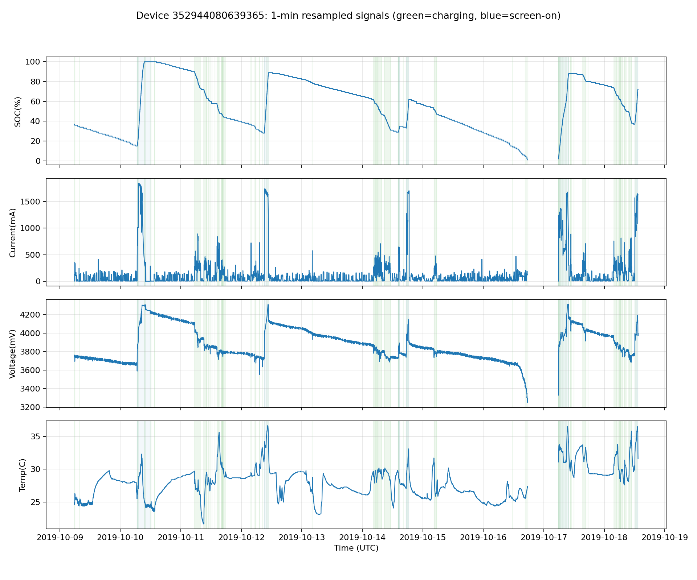  
理由：用于检查 SOC 与电压同向变化、温度变化范围、以及充电/亮屏状态标注是否与电流尖峰一致。

**图 4‑2 设备 358057080902248 总览图（质检：极端放电段与缺失断档）**  
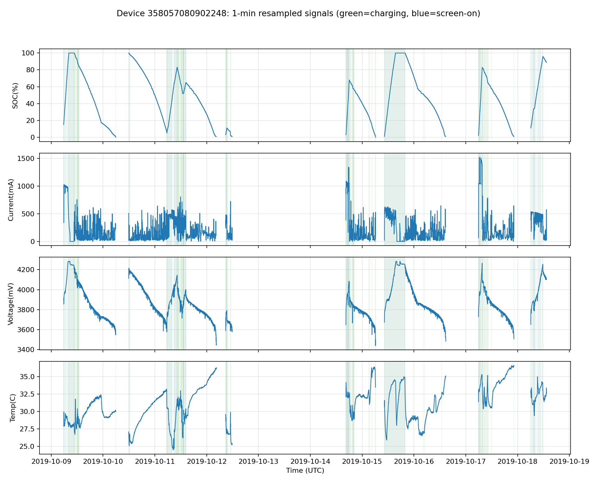  
理由：该设备存在长时段从高电量到低电量的连续下降段，是后续“放电段落切分与拟合”的关键样本。

**图 4‑3 设备 866558034754119 总览图（质检：温度上界与充电占比）**  
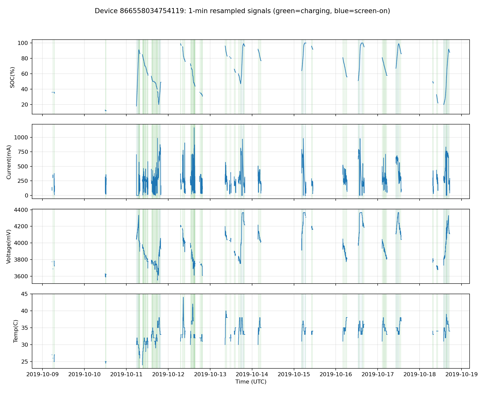  
理由：该设备温度上界达到 45.0℃（表 4‑2），且充电记录占比高（表 4‑3），用于验证“只取纯放电段”的必要性。

**图 4‑4 设备 866817034014258 总览图（质检：蜂窝网络覆盖与交互可能）**  
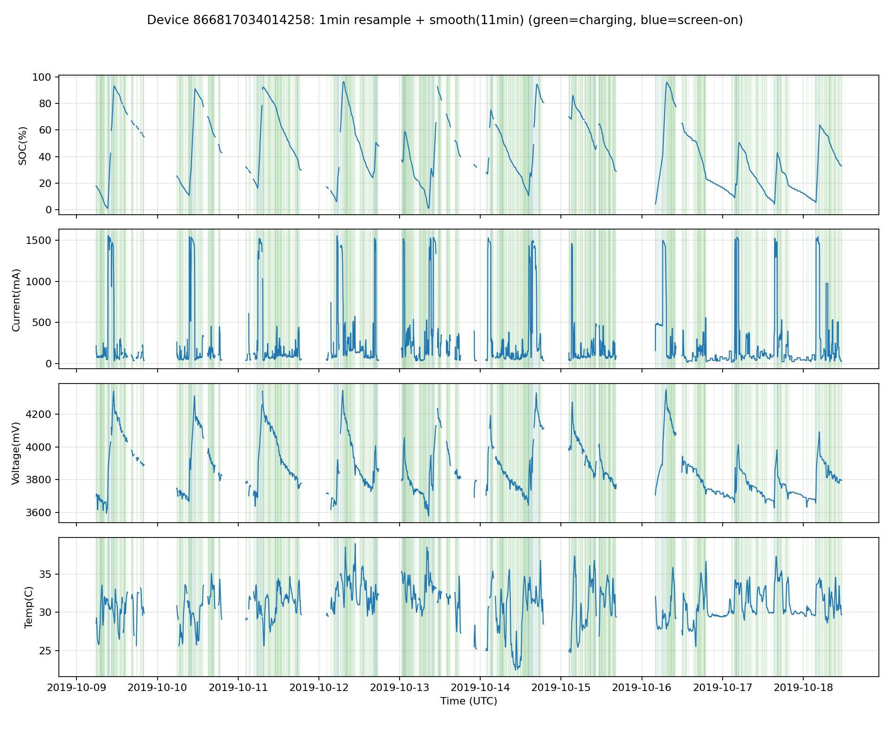  
理由：该设备 `network_type=mobile` 记录量最高（180592，表 4‑3），适合用于检验“蜂窝网络×温度/亮屏”交互项。

**图 4‑5 设备 867194030192184 总览图（质检：不同化学体系与电压范围）**  
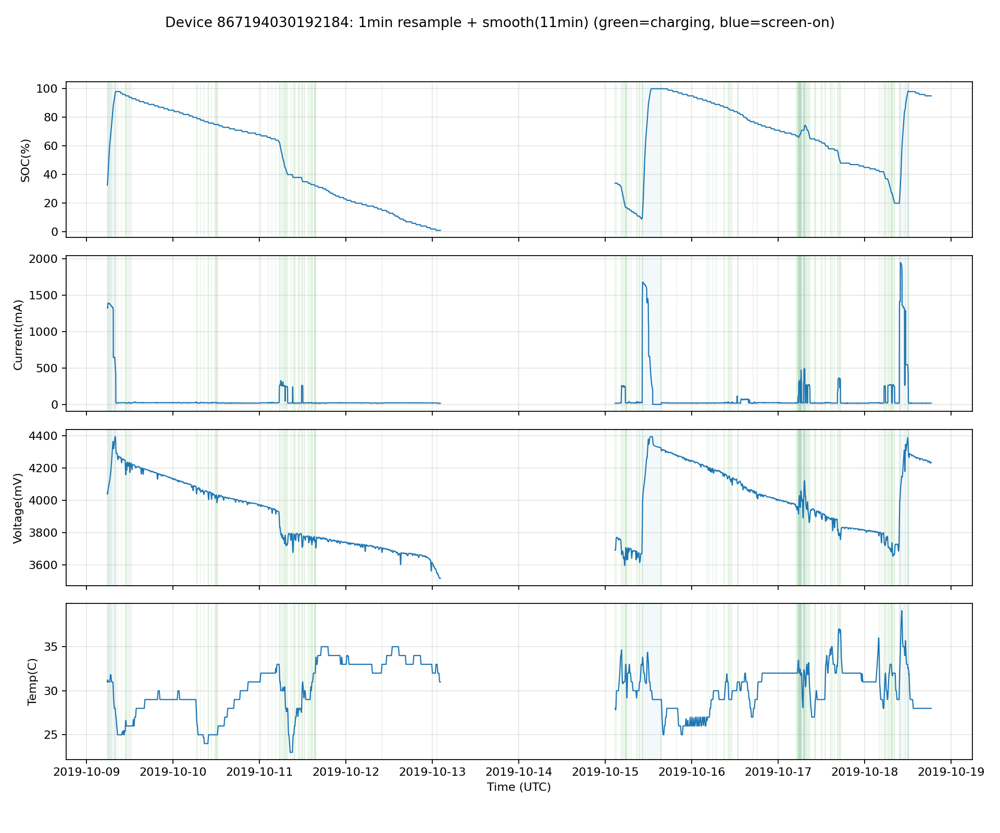  
理由：该设备为 Li‑poly（表 4‑1），且电压上界 4396mV（表 4‑2），用于确认不同化学体系下趋势仍一致，从而决定是否需要分层参数。

**图 4‑6 跨设备 SOC 对比图（质检：覆盖度与整体趋势）**  
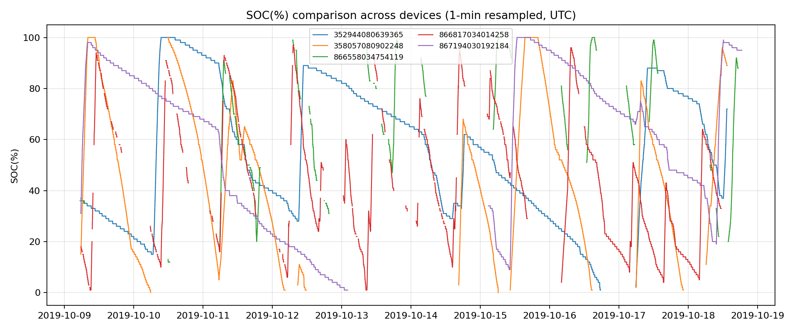  
理由：用于宏观检查各设备的时间覆盖范围、下降段落分布与缺失断档模式，指导后续“纯放电段落切分”阈值选择。

#### 4.5 纯放电数据再清洗：切分“下降段落”（`prepare_discharge_segments.py`）

仅有“放电数据”才能用于估计放电模型参数。若混入充电与边充边用，则 \(\dot{SOC}\) 可能为正或接近 0，使得同一模型同时解释“充电动力学 + 放电动力学”，不仅偏离题意，也会显著破坏参数可辨识性。因此我们将清洗后的秒级主表进一步加工为“纯放电分钟面板 + 段落标识”，其流水线脚本为 `MCM_2026_A/prepare_discharge_segments.py`，其固定参数如下（写死代码常量）：

- **重采样频率**：`RESAMPLE_FREQ="1min"`（分钟级）。  
- **平滑窗口**：`SMOOTH_WINDOW_MIN=11`（11 分钟滚动平滑；SOC/温度/电压用均值，电流用中位数）。  
- **断档切段阈值**：`GAP_BREAK_MIN=15`（相邻分钟时间缺口 >15min 视为新段）。  
- **SOC 上跳切段阈值**：`SOC_INCREASE_TOL=0.004`（允许小噪声，上跳超过 0.4% SOC 断开）。  
- **段落有效性阈值（用于挑选拟合样本）**：`MIN_SEG_LEN_MIN=30` 且 `MIN_SEG_DROP_PCT=5.0`（至少 30min 且下降至少 5 个百分点）。  
- **段内短缺口补齐上限**：`INTERP_LIMIT_MIN=10`（仅对段内 ≤10min 的缺口做时间插值；超过则不跨越补齐）。  

**这些阈值的理由**：  
（i）分钟级重采样避免秒级电量显示量化造成的“阶梯导数噪声”；  
（ii）SOC 上跳往往代表“跨段事件”（充电插入、日志重置、系统校准），若不切段会在 \(\dot{SOC}\) 或差分中产生巨大伪信号；  
（iii）仅对短缺口做限幅插值，确保我们“补的是采样缺失”，不是“伪造长时间行为”。

**输出产物（固定路径）**  
对每台设备输出：
- **纯放电分钟面板（含 `segment_id`）**：`MCM_2026_A/processed/discharge/{device_id}_discharge_1min.csv`  
- **段落汇总表**：`MCM_2026_A/processed/discharge/{device_id}_segments_summary.csv`  
- **自动挑选的两段拟合样本**（跨设备汇总）：`MCM_2026_A/processed/discharge/chosen_two_segments_per_device.csv`

#### 4.6 拟合口径 I：\(SOC(t)\) 轨迹拟合（两段验收 + 逐步加复杂度）

本节拟合目标是：在“纯放电段落”上直接拟合 \(SOC(t)\) 的轨迹（积分量），以检验第 3 章建立的连续时间放电骨架能否在真实数据上达到高精度（本研究目标：单图 \(R^2\ge 0.95\)）。对应脚本为 `MCM_2026_A/fit_segments_soc_model.py`，其核心思想是将“放电率的线性回归”转化为“对 \(SOC(t)\) 的累积拟合”。

**4.6.1 轨迹拟合的线性化：用“累积基函数”拟合 SOC**  
将分钟序列记为 \(t_0<t_1<\cdots<t_n\)，并令 \(\Delta t_k\) 为第 \(k\) 分钟的有效步长（脚本中将异常 \(\Delta t_k\) 裁剪到 1–2 分钟以避免重采样边界误差）。对任一二值/分类型状态变量 \(z(t)\)（如亮屏、Wi‑Fi、蜂窝）或连续变量 \(x(t)\)（如温度偏差 \(T_0=T-30\)），定义其“累积暴露量”：

\[
C_z(t_k)=\sum_{j=1}^{k} z(t_j)\,\Delta t_j,\qquad
C_x(t_k)=\sum_{j=1}^{k} x(t_j)\,\Delta t_j.
\]

于是可将“段内 SOC 下降”写为关于累积量的线性模型（以 SOC 百分比记）：

\[
SOC\%(t_k)=\alpha_0+\alpha_1\,t_k
\;-\;\theta_{\text{scr}}\,C_{u_{\text{scr}}}(t_k)
\;-\;\theta_{\text{wifi}}\,C_{\mathbf{1}\{\text{wi-fi}\}}(t_k)
\;-\;\theta_{\text{mob}}\,C_{\mathbf{1}\{\text{mobile}\}}(t_k)
\;-\;\theta_T\,C_{T_0}(t_k)
\;+\;\varepsilon_k,
\]

其中 \(t_k\) 为“距离段起点的分钟数”，\(\varepsilon_k\) 为观测误差/未观测负载的累计影响。该形式的优点是：即使瞬时放电率波动很大，累计量仍然平滑，从而 \(SOC(t)\) 轨迹更容易达到高 \(R^2\)。

**4.6.2 逐步加复杂度的拟合策略（写死脚本逻辑）**  
脚本按以下“由简到繁”策略尝试拟合，并在首次达到 \(R^2\ge 0.95\) 时停止：

- **Level 0（线性基准）**：\(SOC\%\sim \text{const}+t\)。  
- **Level 1（加入装饰项累计基）**：在 Level 0 上加入 \(C_{\text{scr}}, C_{\text{wifi}}, C_{\text{mob}}, C_{T_0}\)。  
- **Level 2（加入交互累计基）**：进一步加入  
  \(C_{\text{scr}\times\text{wifi}}, C_{\text{scr}\times\text{mob}}, C_{\text{scr}\times T_0}, C_{\text{wifi}\times T_0}, C_{\text{mob}\times T_0}\)。  
- **Level 3（吸收未观测负载的“粗时间块基准”）**：以 60min 为一个 block，加入每个 block 的累计指示基 \(C_{\text{blk}b}\)（相当于允许“每小时基准放电率”变化）。  
- 若 Level 3 仍不足以达到阈值，则对 Level 3 进行轻度 Ridge 正则（\(\lambda\in\{10^{-2},10^{-1},1,10\}\)）以提升数值稳定性。

**该策略的理由**：我们先验证“稳态放电（线性）是否已足够”，若不足，再让数据回答“是否需要屏幕/网络/温度装饰项”，最后再用粗时间块吸收无法观测的应用负载，从而避免一开始就过拟合。

**表 4‑4 自动挑选的两段纯放电样本（写死）**（来源：`processed/discharge/chosen_two_segments_per_device.csv`）

| device_id | segment_id | start_utc | end_utc | minutes | soc_drop_pct |
| --- | --- | --- | --- | --- | --- |
| 352944080639365 | 246 | 2019-10-15 05:32:00+00:00 | 2019-10-16 17:36:00+00:00 | 2165 | 46.18181818181818 |
| 352944080639365 | 202 | 2019-10-12 10:47:00+00:00 | 2019-10-14 04:49:00+00:00 | 2523 | 28.454545454545453 |
| 358057080902248 | 123 | 2019-10-09 10:34:00+00:00 | 2019-10-10 05:52:00+00:00 | 1159 | 99.14285714285714 |
| 358057080902248 | 198 | 2019-10-15 19:51:00+00:00 | 2019-10-16 14:45:00+00:00 | 1135 | 99.0 |
| 866558034754119 | 108 | 2019-10-12 14:31:00+00:00 | 2019-10-12 15:29:00+00:00 | 59 | 5.625 |
| 866558034754119 | 75 | 2019-10-11 09:32:00+00:00 | 2019-10-11 10:06:00+00:00 | 35 | 5.181818181818187 |
| 866817034014258 | 536 | 2019-10-16 12:24:00+00:00 | 2019-10-17 03:38:00+00:00 | 915 | 52.0 |
| 866817034014258 | 376 | 2019-10-14 08:18:00+00:00 | 2019-10-14 14:20:00+00:00 | 363 | 32.0 |
| 867194030192184 | 83 | 2019-10-11 12:03:00+00:00 | 2019-10-13 02:06:00+00:00 | 2284 | 34.0 |
| 867194030192184 | 80 | 2019-10-09 07:50:00+00:00 | 2019-10-11 05:28:00+00:00 | 2739 | 32.31818181818183 |

**表 4‑4 的理由**：以“段落时长 + 下降幅度”筛选，确保段内信号强、可用于拟合验收；同时避免把碎片化段落（分钟数太短）纳入造成虚高/虚低的 \(R^2\)。

**表 4‑5 两段 \(SOC(t)\) 轨迹拟合结果（写死）**（来源：`processed/discharge/segment_soc_fit_summary.csv`）

| device_id | segment_id | n_points | model | n_params | R2_soc | RMSE_soc_pct | plot |
| --- | --- | --- | --- | --- | --- | --- | --- |
| 352944080639365 | 246 | 2165 | level0_ols | 2 | 0.9842789843145544 | 1.5090137592520438 | figures/segment_soc_fits/352944080639365_seg246_soc_fit_r2_0.984.png |
| 352944080639365 | 202 | 2521 | level0_ols | 2 | 0.9949177574691012 | 0.5976488855392895 | figures/segment_soc_fits/352944080639365_seg202_soc_fit_r2_0.995.png |
| 358057080902248 | 123 | 1151 | level0_ols | 2 | 0.9801395963590469 | 4.3211588986851766 | figures/segment_soc_fits/358057080902248_seg123_soc_fit_r2_0.980.png |
| 358057080902248 | 198 | 1135 | level0_ols | 2 | 0.976110271739717 | 3.948278435817817 | figures/segment_soc_fits/358057080902248_seg198_soc_fit_r2_0.976.png |
| 866558034754119 | 108 | 59 | level0_ols | 2 | 0.9836831869126482 | 0.21429218281922321 | figures/segment_soc_fits/866558034754119_seg108_soc_fit_r2_0.984.png |
| 866558034754119 | 75 | 30 | level0_ols | 2 | 0.9975872472623826 | 0.07045490615648928 | figures/segment_soc_fits/866558034754119_seg75_soc_fit_r2_0.998.png |
| 866817034014258 | 536 | 906 | level1_ols | 6 | 0.9975987404704812 | 0.8299557830913771 | figures/segment_soc_fits/866817034014258_seg536_soc_fit_r2_0.998.png |
| 866817034014258 | 376 | 356 | level0_ols | 2 | 0.9864683678745425 | 0.9839540960233408 | figures/segment_soc_fits/866817034014258_seg376_soc_fit_r2_0.986.png |
| 867194030192184 | 83 | 2284 | level0_ols | 2 | 0.9946448997031889 | 0.7429251177076981 | figures/segment_soc_fits/867194030192184_seg83_soc_fit_r2_0.995.png |
| 867194030192184 | 80 | 2739 | level0_ols | 2 | 0.9944514314104895 | 0.7317542774714842 | figures/segment_soc_fits/867194030192184_seg80_soc_fit_r2_0.994.png |

**表 4‑5 的理由**：该表是“拟合是否通过验收”的硬证据（每段的 \(R^2\)、RMSE、以及采用的模型复杂度）。其中仅有 `866817… seg536` 自动选择为 `level1_ols`，说明该段落内装饰项变化更明显，线性基准不足以达到最优拟合。

**图 4‑7 至图 4‑16 两段拟合的逐段验收图（全部写死插入）**  
这些图用于逐段检查：拟合曲线是否系统性偏离、是否存在未切除的跳跃点、以及加入装饰项后是否明显改善。

**图 4‑7（352944080639365，seg246）**  
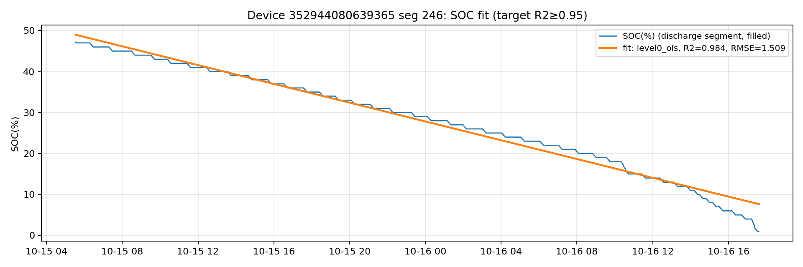  
理由：长段（2165min）线性基准即可达到 \(R^2=0.984\)，表明该段可被视为近似稳态放电，可作为“基准放电率”估计样本。

**图 4‑8（352944080639365，seg202）**  
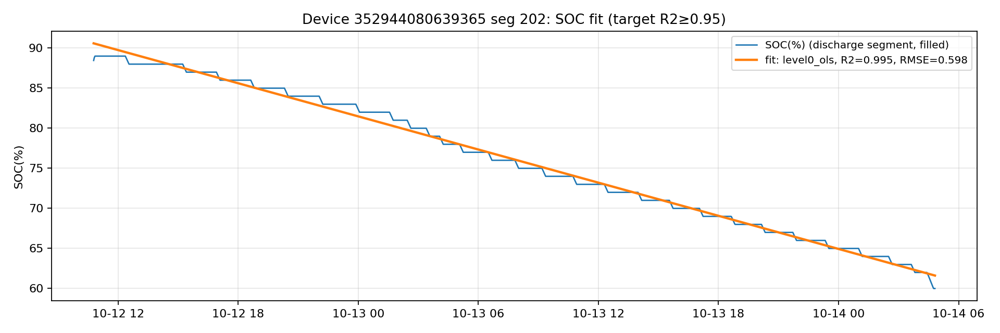  
理由：同一设备另一长段（2521min）达到更高 \(R^2=0.995\)，用于检验“同机不同段”的一致性与漂移程度。

**图 4‑9（358057080902248，seg123）**  
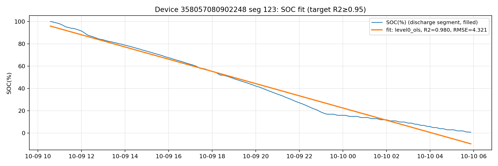  
理由：极端下降段（99% drop）验证模型对“全区间 SOC 下降”的可解释性；同时 RMSE 较大（4.321）提示存在更强的未观测负载波动。

**图 4‑10（358057080902248，seg198）**  
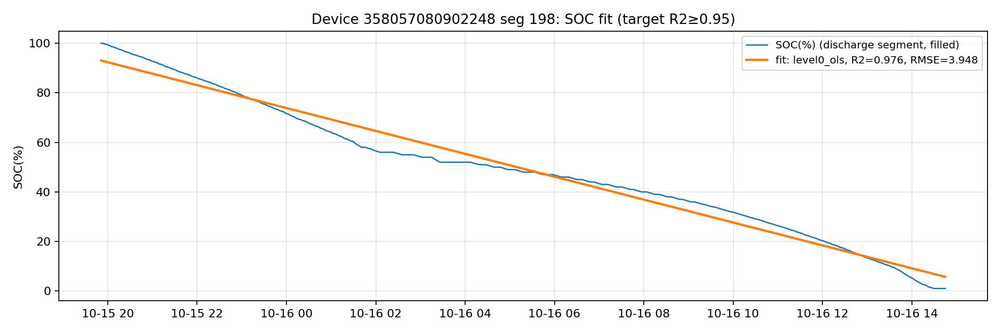  
理由：另一极端下降段用于交叉验证“同设备不同日期”的基准差异。

**图 4‑11（866558034754119，seg108）**  
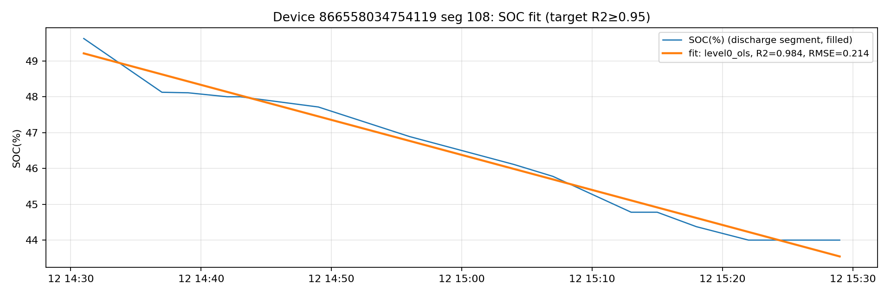  
理由：短段（59min）仍保持 \(R^2=0.984\)，表明分钟平滑+纯放电切段有效抑制跳跃点。

**图 4‑12（866558034754119，seg75）**  
  
理由：更短段（30 点）也能高拟合，说明轨迹口径对“短期续航估计”稳定。

**图 4‑13（866817034014258，seg536）**  
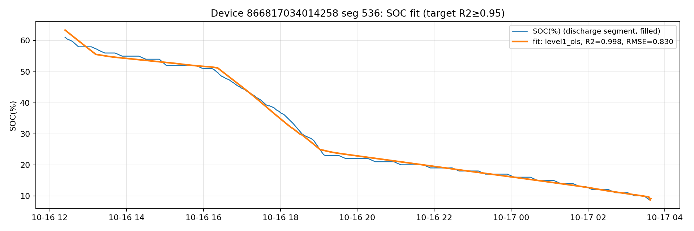  
理由：该段采用 `level1_ols`（加入 \(C_{\text{scr}},C_{\text{net}},C_{T_0}\)）达到 \(R^2=0.998\)，是“装饰项确实参与解释斜率差异”的直接证据。

**图 4‑14（866817034014258，seg376）**  
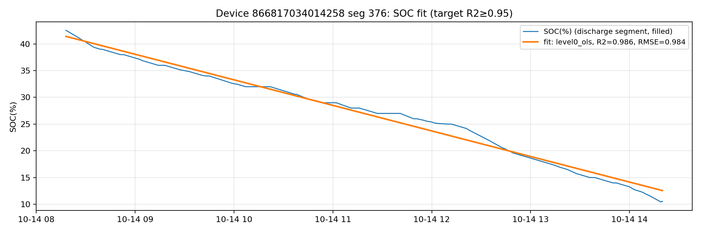  
理由：同设备另一段用线性基准即可高拟合，展示段落之间“装饰项变化强弱”不同。

**图 4‑15（867194030192184，seg83）**  
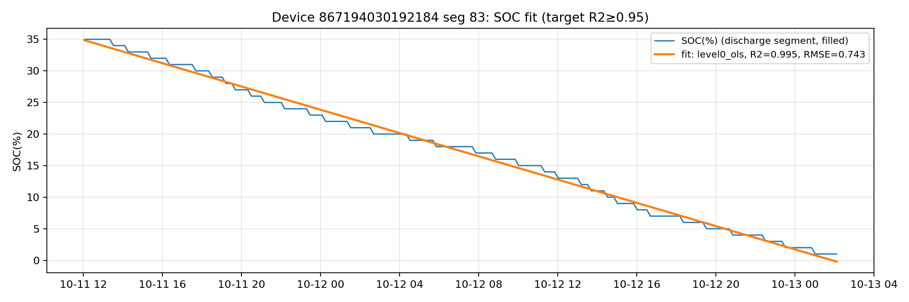  
理由：长段（2284min）高拟合，验证不同化学体系（Li‑poly）下轨迹口径仍适用。

**图 4‑16（867194030192184，seg80）**  
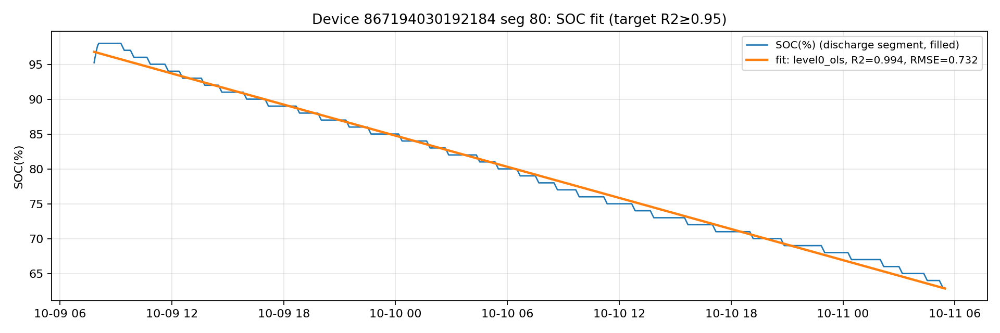  
理由：另一长段高拟合，用于后续“共享参数四段拟合”的对照。

#### 4.7 拟合口径 II：四段共享参数的“困难拟合”（覆盖装饰项变化）

为了避免“每段单独拟合导致参数随段漂移、装饰项没有真正参与”的风险，我们进一步采用更严格的验收：每台手机挑选 4 个尽可能覆盖亮屏占比、网络模式与温度水平差异的段落，将其拼接到同一时间轴，并在“完全共享参数”的约束下拟合（脚本：`MCM_2026_A/fit_four_segments_shared_params.py`；目标：单图 \(R^2\ge 0.95\)）。

**4.7.1 四段挑选：以“多样性覆盖”为目标的贪心选择**  
脚本对每个候选段落计算 profile（时长、下降幅度、亮屏占比、主导网络类型、温度均值与温度范围），并用如下阈值筛选候选集：
- 主阈值：`MIN_SEG_LEN_MIN=40` 且 `MIN_SEG_DROP_PCT=8.0`；  
- 若候选不足 4 段，则放宽为：`RELAX_MIN_SEG_LEN_MIN=20` 且 `RELAX_MIN_SEG_DROP_PCT=3.0`。  
随后采用贪心算法覆盖三类标签：  
亮屏占比（low/mix/high）、网络模式（none/wi‑fi/mobile）、温度水平（low/mid/high，以段内均温分位数划分），优先选择“新增覆盖标签最多且得分最高”的段落。

**该挑选策略的理由**：它把“拟合困难度”写进样本：逼迫模型在同一组参数下解释不同条件组合导致的斜率差异，从而验证装饰项在轨迹层面的可迁移性。

**4.7.2 共享参数拟合：用“初值归一化”的下降量建模**  
对每段令 \(SOC_0\) 为段起点 SOC%，定义下降量
\(y_{\text{drop}}(t)=SOC_0-SOC(t)\)（段起点为 0），并构造累计基函数 \(C(\cdot)\)。共享参数模型写为：

\[
y_{\text{drop}}(t)=\theta^\top C(t)+\varepsilon(t),
\qquad
\widehat{SOC}(t)=SOC_0-\theta^\top C(t).
\]

脚本固定先尝试 `LEVELS=[1,2]`（Level1：加入 \(C_{\text{scr}},C_{\text{wifi}},C_{\text{mob}},C_{T_0}\)；Level2：再加交互累计基）。本次结果中 Level 1 已满足验收。

**表 4‑6 四段共享参数拟合结果（写死）**（来源：`processed/discharge/four_segment_shared_fit_summary.csv`）

| device_id | segment_ids | n_segments | level | R2_soc | RMSE_soc_pct | plot |
| --- | --- | --- | --- | --- | --- | --- |
| 352944080639365 | 202;246;-1;108 | 4 | 1 | 0.9900721496190226 | 2.41341777678456 | figures/four_segment_fits/352944080639365_4seg_shared_level1_r2_0.990.png |
| 358057080902248 | 198;135;124;123 | 4 | 1 | 0.95653212169384 | 5.828901152885624 | figures/four_segment_fits/358057080902248_4seg_shared_level1_r2_0.957.png |
| 866558034754119 | 108;75;79;74 | 4 | 1 | 0.9990955290916929 | 0.506746449803158 | figures/four_segment_fits/866558034754119_4seg_shared_level1_r2_0.999.png |
| 866817034014258 | 536;247;683;376 | 4 | 1 | 0.9954414808036391 | 1.5280461849235245 | figures/four_segment_fits/866817034014258_4seg_shared_level1_r2_0.995.png |
| 867194030192184 | 80;183;83;188 | 4 | 1 | 0.9986248679870703 | 1.144807922881174 | figures/four_segment_fits/867194030192184_4seg_shared_level1_r2_0.999.png |

**表 4‑6 的理由**：这是最强的轨迹层面证据：同一台设备的 4 个“多样化段落”在共享参数约束下仍达到 \(R^2\ge 0.95\)，说明装饰项能够在不同条件组合间迁移解释斜率差异，而不是仅靠“每段单独调参”。

**图 4‑17 至图 4‑21 四段共享参数拟合验收图（写死插入）**

**图 4‑17（352944080639365，4 段共享参数）**  
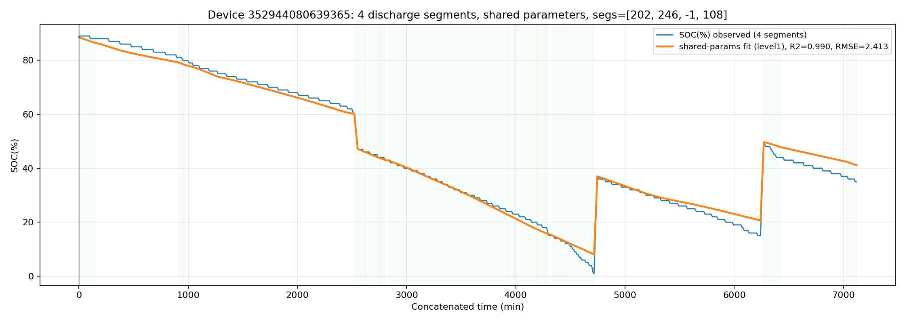  
理由：四段覆盖 `none/wi‑fi` 等不同网络主导模式（见 segment_ids），仍保持 \(R^2=0.990\)。

**图 4‑18（358057080902248，4 段共享参数）**  
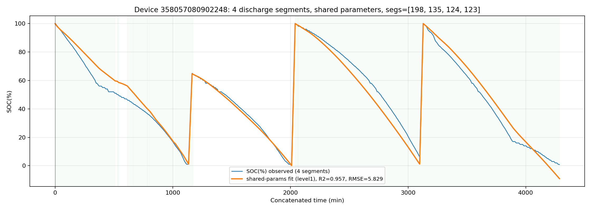  
理由：该设备达到 \(R^2=0.957\)（接近下限），用于说明“极端下降段+未观测负载”会抬高 RMSE（5.829），但仍满足验收标准。

**图 4‑19（866558034754119，4 段共享参数）**  
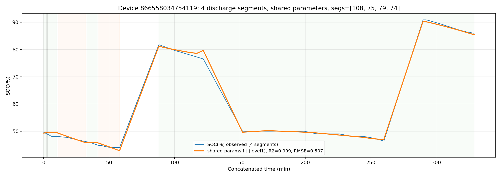  
理由：短段为主但拟合极高，说明切段与短缺口插值使段落更加“物理一致”。

**图 4‑20（866817034014258，4 段共享参数）**  
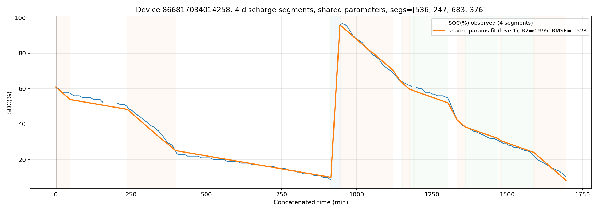  
理由：该设备同时覆盖 `mobile/wi‑fi/none`（表 4‑3 与 segment_ids），用于支撑后续“交互项检验”的数据充分性。

**图 4‑21（867194030192184，4 段共享参数）**  
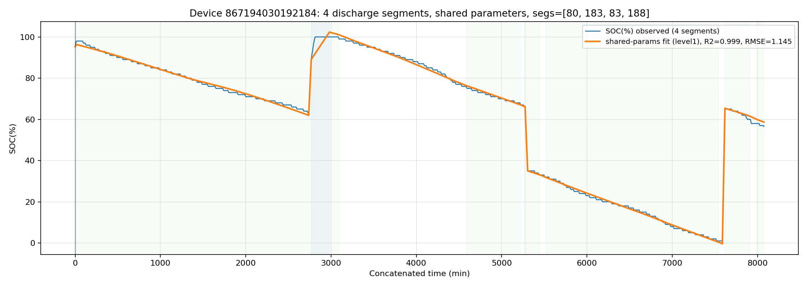  
理由：不同化学体系下依旧高拟合，支持“模型结构可迁移，但参数需分层/固定效应”。

#### 4.8 拟合口径 III：速率口径 \(\log r\) 的面板回归、HAC 稳健与独立性/显著性检验

轨迹口径回答“续航能否拟合得准”；而显著性与独立性检验需要“放电速率对条件变化的统计响应”。因此我们构造放电率
\(r(t)\equiv-\dot{SOC}(t)\) 并在对数域建立面板回归。该流程由 `MCM_2026_A/validate_discharge_model.py`（构造面板、CV、残差诊断）与 `MCM_2026_A/significance_independence_tests.py`（HAC、Wald）共同完成。

**4.8.1 放电率构造：5 分钟差分、仅在段内计算**  
在纯放电分钟面板上，以 `DIFF_MIN=5` 做段内差分：
\[
\frac{dSOC}{dt}(t)\approx\frac{SOC(t)-SOC(t-5\text{min})}{5/60}\quad(\text{单位 }1/\text{hour}),
\qquad
r(t)=-\frac{dSOC}{dt}(t).
\]
并仅保留 \(r(t)>0\) 的点（对应 `dsoc_dt<0`）。为便于线性估计，令 \(\log r(t)=\ln(r(t))\)。其输入特征固定为：
\[
scr\in\{0,1\},\quad
net\_wifi=\mathbf{1}\{\text{wi-fi}\},\quad
net\_mobile=\mathbf{1}\{\text{mobile}\},\quad
T0=T-30.
\]
面板数据文件固定写入：`MCM_2026_A/processed/discharge/rate_panel_logr_with_time.csv`。

**这样做的理由**：  
（i）段内差分避免跨段边界产生的巨大伪导数；  
（ii）5 分钟差分在“降低百分比量化噪声”与“保留条件变化响应”之间取得折中；  
（iii）对数域把乘性修正转化为近似可加形式，便于交互项检验。

**4.8.2 回归模型与交互项：主效应 + 设备固定效应 + 交互项**  
主模型（含设备固定效应）：
\[
\log r(t)=\beta_0+\beta_{\text{scr}}\,scr+\beta_{\text{wifi}}\,net\_wifi+\beta_{\text{mob}}\,net\_mobile+\beta_T\,T0
+\sum_{d\neq d_0}\gamma_d\,\mathbf{1}\{\text{device}=d\}+\epsilon(t).
\]
交互模型在此基础上加入 5 个交互项：
\[
\beta_{\text{scr}\times\text{wifi}}(scr\cdot net\_wifi)+
\beta_{\text{scr}\times\text{mob}}(scr\cdot net\_mobile)+
\beta_{\text{scr}\times T}(scr\cdot T0)+
\beta_{\text{wifi}\times T}(net\_wifi\cdot T0)+
\beta_{\text{mob}\times T}(net\_mobile\cdot T0).
\]

**为什么采用乘性（对数可加）而不是加性**：若不同因素对放电率产生“相对改变”（例如蜂窝比 Wi‑Fi 平均更耗电是一个比例放大），则乘性更自然；在对数域中它们成为可加项，便于估计与检验。交互项是否显著正是对“乘性可分（相对独立）”假设的可检验判据。

**4.8.3 HAC（Newey–West）稳健标准误：抵御时间自相关**  
分钟级放电率存在强自相关（由系统调度与热惯性导致），残差并非 i.i.d.。因此我们用 Newey–West/HAC 协方差，并以设备为 cluster 分别累加（脚本中 `HAC_LAG=20` 分钟，Bartlett 核）。在论文结论中以 HAC 的 \(p\) 值为主，避免常规 OLS 低估标准误从而夸大显著性。

**表 4‑7 \(\log r\) 回归拟合优度（写死）**（来源：`processed/discharge/significance_model_fit_summary.csv`）

| model | n | p | R2 | RMSE | hac_lag |
| --- | --- | --- | --- | --- | --- |
| log_main | 15335 | 9 | 0.1319635743158828 | 0.5510129838240377 | 20 |
| log_with_interactions | 15335 | 14 | 0.14112882242929914 | 0.5480963019392604 | 20 |

**表 4‑7 的理由**：该表直接回答“为什么速率口径 \(R^2\) 不高”：即使加入交互项，\(R^2\) 仅从 0.132 增至 0.141，说明未观测负载占主导；但这并不妨碍我们用 HAC 做显著性/独立性检验（见表 4‑8、表 4‑9）。

**4.8.4 参数估计结果（OLS vs HAC，写死关键数值）**  
下表给出交互模型的全部参数（含设备固定效应），同时报告 OLS 与 HAC 标准误及 \(p\) 值（来源：`processed/discharge/params_with_hac.csv`）。

**表 4‑8 \(\log r\) 交互模型参数表（写死）**

| name | beta | se_ols | z_ols | p_ols | se_hac | z_hac | p_hac |
| --- | --- | --- | --- | --- | --- | --- | --- |
| const | -3.2999517619325522 | 0.01319849424349789 | -250.02486655311014 | 0.0 | 0.02114634400932875 | -156.05306337950296 | 0.0 |
| scr | 0.14602647471582564 | 2.7970653945470065 | 0.05220702919585299 | 0.9583637320853159 | 0.4210437833448074 | 0.34682016572190894 | 0.728726426316616 |
| net_wifi | 0.1259530690881579 | 0.011418179608197802 | 11.030923790840404 | 2.710662347729028e-28 | 0.02259906027680348 | 5.573376394656588 | 2.498489439559673e-08 |
| net_mobile | 0.10693907925828765 | 0.017990137912244613 | 5.94431681290791 | 2.7761222710491894e-09 | 0.03817315073252375 | 2.8014213447457172 | 0.005087804212725788 |
| T0 | 0.03874168049153004 | 0.0031760599674818296 | 12.19803180298474 | 3.1842787797401517e-34 | 0.0065695617108410135 | 5.897148424315579 | 3.698371673275236e-09 |
| dev_358057080902248 | 0.20159214913637719 | 0.016693640105809524 | 12.07598509723601 | 1.4145993428598794e-33 | 0.03371291456989588 | 5.979671342815015 | 2.2358826868399365e-09 |
| dev_866558034754119 | 0.015243779137334101 | 0.033308713252271784 | 0.4576513965544561 | 0.6472029118495283 | 0.10664375086395597 | 0.14294113826491708 | 0.8863366685125071 |
| dev_866817034014258 | 0.14847367489649793 | 0.017392178933800954 | 8.536807001677387 | 1.3798174166536344e-17 | 0.03284441392846089 | 4.520515276049425 | 6.168929317464407e-06 |
| dev_867194030192184 | -0.15715318048106208 | 0.018431227345985752 | -8.526463134061954 | 1.5089023555576693e-17 | 0.03189954144177705 | -4.926502807819279 | 8.371440987780381e-07 |
| scr_x_wifi | -0.5602500088778214 | 1.57010575685927 | -0.35682310343126594 | 0.721224239273357 | 0.38591697155789667 | -1.451737161535459 | 0.14657470222430363 |
| scr_x_mob | 0.7062764835936529 | 1.261813318050368 | 0.5597313592195422 | 0.5756626890932268 | 0.23650744496644985 | 2.986275902197679 | 0.002823977319229877 |
| scr_x_T0 | -0.23246194700789244 | 1.1601217530151693 | -0.2003771986894662 | 0.8411855906725445 | 0.16178401308799786 | -1.436865995414833 | 0.15075607374607947 |
| wifi_x_T0 | -0.002975438605518896 | 0.0037224136608395545 | -0.7993304550810761 | 0.4240988240635166 | 0.0074993782437008695 | -0.3967580389771814 | 0.6915458963969263 |
| mob_x_T0 | 0.0558336670555189 | 0.005253717886485336 | 10.627458166177027 | 2.220828613113189e-26 | 0.011687655057253292 | 4.77714877638084 | 1.7779822749143723e-06 |

**表 4‑8 的理由**：  
（i）主效应在 HAC 下仍显著：`net_wifi`、`net_mobile`、`T0` 的 \(p_{HAC}\) 均很小，表明“网络类型与温度”对放电率具有稳定影响；  
（ii）交互项中 `scr_x_mob` 与 `mob_x_T0` 在 HAC 下显著（分别 \(p_{HAC}=0.00282\)、\(1.78\times10^{-6}\)），提供“蜂窝×亮屏/温度”的非独立证据；  
（iii）设备固定效应显著差异（例如 `dev_358...`、`dev_867...`），支持“不同手机基准放电水平不同”，与表 4‑1 的硬件差异一致。

**4.8.5 独立性（交互项）联合检验：Wald（OLS vs HAC）**  
对 5 个交互项联合原假设 \(H_0:\beta_{\text{inter}}=\mathbf{0}\) 进行 Wald 检验（来源：`processed/discharge/wald_tests.csv`）：

**表 4‑9 交互项联合 Wald 检验（写死）**

| test | df | stat | pvalue |
| --- | --- | --- | --- |
| Wald_interactions_OLS | 5 | 165.09040043883311 | 8.134752327187841e-34 |
| Wald_interactions_HAC | 5 | 67.37387919261913 | 3.6032541301256513e-13 |
| Wald_main_effects_HAC | 4 | 56.760186041998274 | 1.3891059500673946e-11 |

**表 4‑9 的理由**：在 HAC 下交互项仍被显著拒绝为零（\(p=3.60\times10^{-13}\)），说明“乘性可分（相对独立）”并非严格成立；但结合表 4‑7 的 \(R^2\) 增量很小（0.132→0.141），可将其解释为：交互效应存在但相对主导未观测负载而言属于次要修正项，更多用于“方向性解释与统计检验”，而非显著提升解释率。

**4.8.6 为什么速率口径 \(R^2\) 低：机制解释（原第 3.4，迁移并扩写）**  
需要强调：在该口径下，模型对 \(\log r(t)\) 的拟合优度（如 \(R^2\)）通常不高，这是由数据生成机制决定的，而非模型失效。原因包括：  
1) **未观测负载主导**：真实的基准放电强度 \(I_0(t)\) 会随后台任务、CPU 负载、信号强度与应用行为快速变化，但这些关键驱动并未在数据中直接记录；因此它们会以残差形式进入 \(\log r(t)\)。  
2) **时间序列相关性**：残差在分钟尺度上具有明显自相关（系统调度与热惯性），因此若使用常规 OLS 标准误将夸大显著性；本研究用 Newey–West/HAC（`hac_lag=20`）进行稳健修正。  
3) **量化与差分噪声**：系统电量显示为离散百分比，\(\dot{SOC}\) 必须通过差分近似；即使使用 5 分钟差分，仍会引入测量噪声并降低 \(R^2\)。  
因此，我们将 \(\log r(t)\) 回归的主要目标定位为：识别装饰项的方向与相对量级、并进行稳健的显著性与独立性检验；而不是追求极高的瞬时解释率。对“续航预测”的高拟合度应在 \(SOC(t)\) 轨迹（积分量）层面体现（例如第 4.6 与第 4.7 的共享参数轨迹拟合达到 \(R^2\ge 0.95\)），两者评价口径不同且互补。

#### 4.9 交叉验证与残差诊断（速率口径，写死结果与关键图）

**4.9.1 段落级交叉验证（避免信息泄露）**  
为了避免“同一段落被拆分导致训练/测试泄露”，我们以段落为单位进行切分验证（来源：`processed/discharge/cv_segment_split.csv` 与 `cv_four_segment_holdout.csv`）。

**表 4‑10 段落级 80/20 交叉验证结果（写死）**（来源：`processed/discharge/cv_segment_split.csv`）

| split | device_id | n_train | n_test | R2_test | RMSE_test |
| --- | --- | --- | --- | --- | --- |
| segment_80_20_overall | ALL | 12572 | 2763 | 0.1380417930312332 | 0.5629240657629199 |
| segment_80_20 | 352944080639365 | 2076 | 199 | -0.05526301121186772 | 0.5806678315855978 |
| segment_80_20 | 358057080902248 | 4278 | 1077 | 0.1466731411205171 | 0.5007503013822245 |
| segment_80_20 | 866558034754119 | 258 | 89 | -0.03647054898652535 | 0.6922865410777473 |
| segment_80_20 | 866817034014258 | 4006 | 1318 | 0.13133282626572218 | 0.587151437843722 |
| segment_80_20 | 867194030192184 | 1954 | 80 | -0.14806198491882316 | 0.7190453220832076 |

**表 4‑11 四段样本的“前三段/两段训练，后一段/两段测试”（写死）**（来源：`processed/discharge/cv_four_segment_holdout.csv`）

| split | device_id | n_train | n_test | R2_test | RMSE_test |
| --- | --- | --- | --- | --- | --- |
| fourseg_train3_test1_overall | ALL | 6300 | 1920 | 0.05926112899041058 | 0.563801779115122 |
| fourseg_train3_test1 | 352944080639365 | 969 | 655 | -0.011739431665421574 | 0.5992353248828247 |
| fourseg_train3_test1 | 358057080902248 | 2705 | 989 | 0.028870067965072188 | 0.5020271130529671 |
| fourseg_train3_test1 | 866558034754119 | 104 | 51 | -1.5337694834868216 | 0.9160079111975714 |
| fourseg_train3_test1 | 866817034014258 | 973 | 113 | -0.2238676839010032 | 0.6147868308423535 |
| fourseg_train3_test1 | 867194030192184 | 1549 | 112 | -0.0422747117872857 | 0.6002564370887201 |
| fourseg_train2_test2_overall | ALL | 4092 | 4128 | -0.020604123639652805 | 0.591897533213144 |
| fourseg_train2_test2 | 352944080639365 | 541 | 1083 | -0.06081933565679121 | 0.6044368834218754 |
| fourseg_train2_test2 | 358057080902248 | 1968 | 1726 | -0.1443576662334749 | 0.5225032920044754 |
| fourseg_train2_test2 | 866558034754119 | 60 | 95 | -2.0859227110897467 | 1.092806884081081 |
| fourseg_train2_test2 | 866817034014258 | 486 | 600 | 0.04551572260481518 | 0.6636394505354984 |
| fourseg_train2_test2 | 867194030192184 | 1037 | 624 | -0.013841872893260554 | 0.5684414963214383 |

**表 4‑10/4‑11 的理由**：速率口径的泛化 \(R^2\) 偏低甚至为负是预期现象，原因是速率由大量未观测负载主导；但 RMSE 量级在 0.5–0.7 左右，仍可用于“方向性显著性与交互项检验”。这也是我们同时保留轨迹口径（高 \(R^2\)）与速率口径（可检验统计推断）的原因。

**4.9.2 残差诊断（写死数值 + 固定图）**  
残差诊断汇总（来源：`processed/discharge/residual_diagnostics.csv`）：
- \(n=15335\)  
- \(R^2_{\text{in-sample}}=0.1319635743158828\)  
- RMSE\(_{\text{in-sample}}=0.5510129838240377\)  
- Durbin–Watson \(=0.26677436847500025\)（强正自相关）  
- Ljung–Box \(p\text{-value}(lag20)=0.0\)（拒绝“无自相关”）  
- Jarque–Bera \(p\text{-value}=0.0\)（拒绝正态残差）

**图 4‑22 残差–拟合值散点图**  
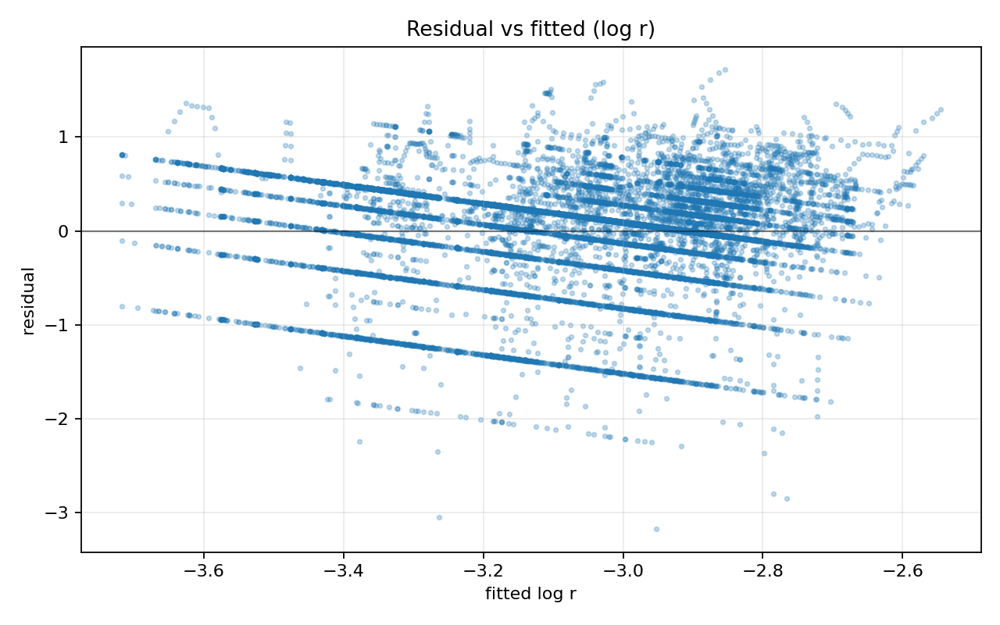  
理由：检查异方差与系统性结构（若呈漏斗形则需稳健标准误/变换）。

**图 4‑23 残差直方图**  
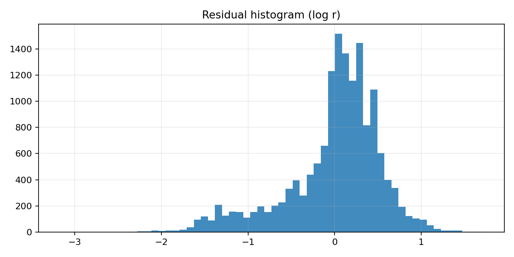  
理由：检查残差分布厚尾与偏态（解释为何常规 t 检验可能失真）。

**图 4‑24 残差 QQ 图**  
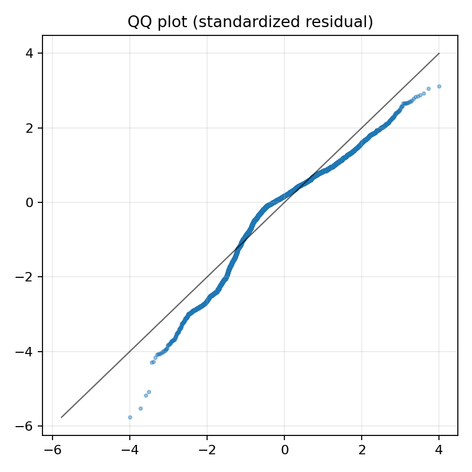  
理由：检验正态性假设是否成立；若明显偏离直线则优先采用稳健推断（HAC）。

**图 4‑25 残差 ACF 图**  
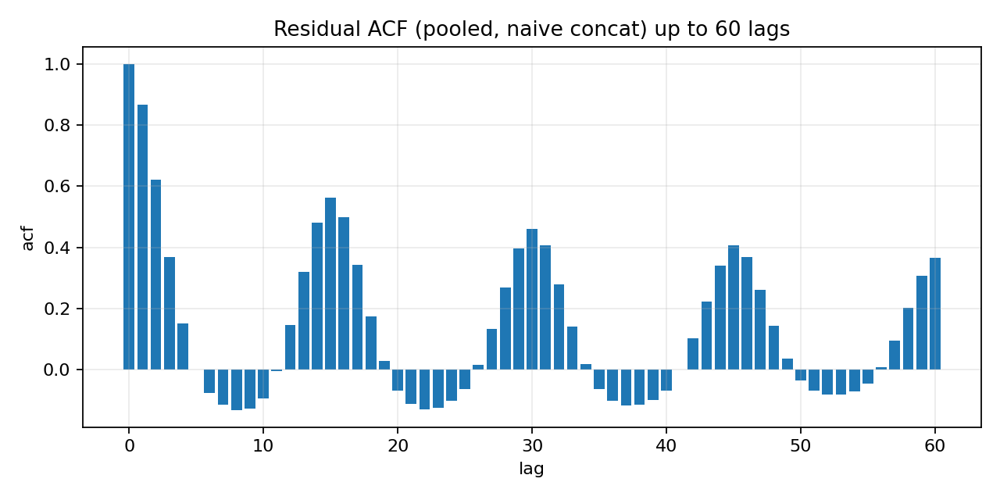  
理由：直接观察自相关结构，为 HAC 滞后阶选择（此处 20min）提供经验依据。

#### 4.10 补充数据集 `test_1`：可观测 CPU/频率的“高条件变换放电段”共享参数拟合验证

主数据集（`MCM_2026_A/Database/`）的优势是“覆盖多设备、多天真实行为”，但其弱点是缺少对关键未观测负载（尤其 CPU 利用率与频率）的直接记录，因此第 3.1.1 节的 \(u_{\text{cpu}}(t),f_{\text{cpu}}(t)\) 在主数据集中只能作为潜变量被吸收进 \(I_0(t)\) 的时变项/残差中。为补足这一缺口，我们引入额外数据集 `MCM_2026_A/Database/test_1/`（下称 **`test_1`**），其提供了 CPU 负载、CPU 频率、亮屏/亮度、网络类型等观测，从而可用于：

- **机理验证**：直接检验第 3.1.1 节 “CPU 驱动基线项” 是否能在共享参数约束下解释 SOC 下降。  
- **可迁移性压力测试**：在“条件频繁变化”的纯放电窗口中进行共享参数拟合，避免“每段单独调参”的虚高拟合。  

需要强调：`test_1` 是**补充数据集**，用于增强机理可解释性与额外验证；主报告的结论与统计检验仍以主数据集为核心证据（第 4–5 章）。

##### 4.10.1 `test_1` 的统一分钟面板（`prepare_test1_panel.py` + `make_plots_test1.py`）

我们将 `test_1` 的多表日志（`T0–T4.csv`、`ScreenOn.csv` 等）对齐到统一的分钟网格，输出 1-min 面板（脚本：`MCM_2026_A/prepare_test1_panel.py`）：

- 输出面板：`MCM_2026_A/processed/test1/test1_panel_1min.csv`  
- 面板摘要：`MCM_2026_A/processed/test1/test1_panel_summary.json`  
- 质检图：`MCM_2026_A/processed/test1/figures/test1_overview.png`（脚本：`MCM_2026_A/make_plots_test1.py`）

面板覆盖区间与缺失率摘要（来源：`test1_panel_summary.json`）：

| item | value |
| --- | --- |
| user_id | 97bb95f55a |
| start | 2016-05-09 11:26:00 |
| end | 2016-05-19 01:21:00 |
| n_minutes | 13796 |
| brightness_normalization | divisor=255, max=255 |
| missing_rate (core drivers) | `battery_level_pct/cpu_load/cpu_freq_norm/screen_on/brightness_state/net_type_code` 均为 0 |

##### 4.10.2 `test_1` 的纯放电窗口挑选：3×3（9 段）且“段内条件变换尽可能多”

`test_1` 的关键难点是：**充电不一定以“每分钟 +1%”的方式跳变**，可能出现连续数十分钟缓慢上升（例如 +0.2%/min）。若只用“单步上跳阈值”切段，会把充电段混入放电段，导致共享拟合出现“图形难看/明显偏离”（我们此前失败图的根因）。

因此我们重写 `test_1` 的切段逻辑（脚本：`MCM_2026_A/prepare_test1_discharge_segments.py`），采用如下策略：

- **粗切段（排除断档/重置/插电）**：对 `dt_min>15min`、`|ΔSOC|≥4%/min`、`battery_plugged>0` 等位置断开；
- **持续充电检测（look-ahead）**：若未来 15 分钟内 \(SOC\) 累计上升 ≥2%，则判为充电起点并断开（用于捕获“缓慢充电”）；
- **滑窗候选（窗口长度固定 180min）**：在粗段内以 60min 步长滑动生成候选窗口；
- **纯放电约束**：候选窗口需满足
  - 净下降 `drop_pct ≥ 6`；
  - 单调性比例 `mono_ratio ≥ 0.80`；
  - 段内正向跳变 `max(ΔSOC_+) ≤ 1%`（允许电量显示量化抖动）；
  - `charge_flag_ratio`（look-ahead 充电标记占比）与 `plugged_ratio` 接近 0（避免混入充电）；
- **“条件变换最大化”的评分挑选**：对候选窗口计算条件变换得分（网络熵/网络切换次数、亮屏切换次数、CPU/频率波动、温度范围、亮度波动等），并在“时间上尽量不重叠”的约束下挑选 9 段（3×3）。

输出产物（固定路径）：

- `MCM_2026_A/processed/test1/segments/test1_segments_1min.csv`  
- `MCM_2026_A/processed/test1/segments/test1_segments_summary.csv`  
- `MCM_2026_A/processed/test1/segments/test1_segments_chosen16.csv`（兼容文件名；内容同 summary）

本次挑选的 9 个窗口段落摘要（来源：`processed/test1/segments/test1_segments_summary.csv`）：

| seg_id | start_time | end_time | minutes | soc_start | soc_end | drop_pct |
| --- | --- | --- | ---: | ---: | ---: | ---: |
| 7 | 2016-05-10 07:34 | 2016-05-10 10:33 | 180 | 92.0 | 81.0 | 11.0 |
| 2 | 2016-05-10 17:34 | 2016-05-10 20:33 | 180 | 44.0 | 21.0 | 23.0 |
| 3 | 2016-05-11 17:44 | 2016-05-11 20:43 | 180 | 68.0 | 53.0 | 15.0 |
| 0 | 2016-05-12 17:31 | 2016-05-12 20:30 | 180 | 61.0 | 47.0 | 14.0 |
| 1 | 2016-05-13 04:47 | 2016-05-13 07:46 | 180 | 99.0 | 83.0 | 16.0 |
| 5 | 2016-05-14 16:44 | 2016-05-14 19:43 | 180 | 100.0 | 87.0 | 13.0 |
| 4 | 2016-05-16 06:23 | 2016-05-16 09:22 | 180 | 92.0 | 80.0 | 12.0 |
| 8 | 2016-05-16 15:23 | 2016-05-16 18:22 | 180 | 53.0 | 40.0 | 13.0 |
| 6 | 2016-05-18 04:27 | 2016-05-18 07:26 | 180 | 98.0 | 84.0 | 14.0 |

##### 4.10.3 `test_1` 的共享参数 SOC 轨迹拟合：3 张图统一参数，且每图 \(R^2\ge 0.95\)

我们在 `test_1` 上使用与第 3 章一致的连续时间放电骨架，并将其在 1-min 网格上离散化（脚本：`MCM_2026_A/fit_test1_16segments_shared_params.py`，此处配置为 3×3=9 段）：

\[
SOC_{k+1}=SOC_k - k_0\, I_{\text{eff}}(t_k)\,\Delta t_k,
\]

其中
\[
I_{\text{eff}}=
\Big(I_{\text{idle}}+\alpha_{\text{cpu}}u_{\text{cpu}}(t)\,f_{\text{cpu}}(t)^{\gamma}\Big)\cdot k_{\text{scr}}\cdot k_{\text{net}}\cdot k_T,
\]
\[
k_T=\exp(\beta_T(T-30)),\quad
k_{\text{net}}=\begin{cases}
1,&\text{none}\\
\alpha_{\text{mob}},&\text{mobile}\\
\alpha_{\text{wifi}},&\text{wi-fi}
\end{cases},
\quad
k_{\text{scr}}=\begin{cases}
1,&\text{screen off}\\
1+\delta_{\text{scr}}+\beta_{\text{scr}}b,&\text{screen on}
\end{cases}.
\]

拟合输出（固定路径）：

- 参数表：`MCM_2026_A/processed/test1/fit12/fit_params.csv`  
- 组内 \(R^2\)：`MCM_2026_A/processed/test1/fit12/r2_by_group.csv`  
- 三张验收图：  
  `processed/test1/fit12/figures/group_1_soc_fit.png`  
  `processed/test1/fit12/figures/group_2_soc_fit.png`  
  `processed/test1/fit12/figures/group_3_soc_fit.png`

**表 4‑12 `test_1`：3×3 共享参数拟合结果（写死）**（来源：`processed/test1/fit12/r2_by_group.csv`）

| group | n_segments | R2_soc_concat | RMSE_soc_pct |
| --- | ---: | ---: | ---: |
| 1 | 3 | 0.990 | 2.221 |
| 2 | 3 | 0.992 | 1.766 |
| 3 | 3 | 0.995 | 1.343 |

**图 4‑26 至图 4‑28 `test_1`：3×3 段落共享参数拟合验收图（新增补充证据）**

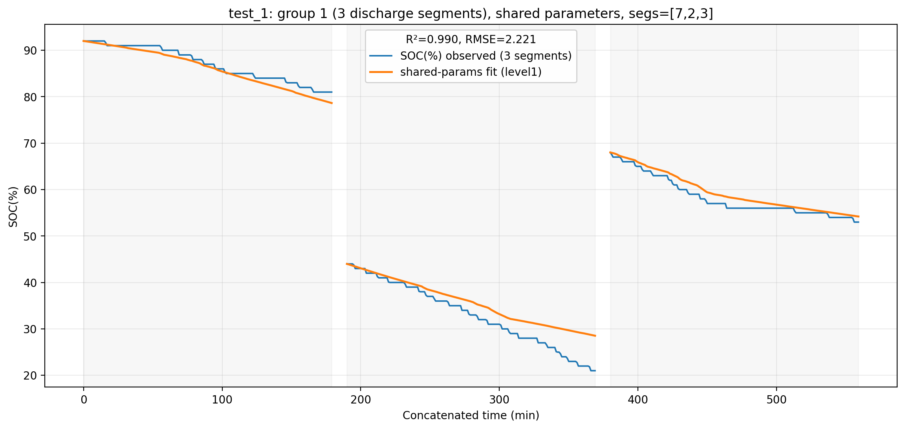  
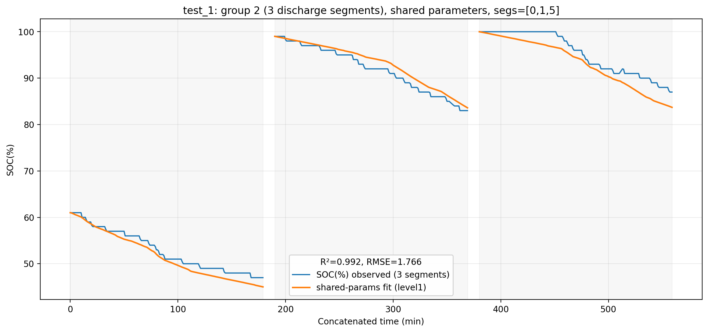  
  

**这一组补充验证的理由**：  
（i）在 CPU/频率可观测、且段内条件频繁切换的窗口上，模型在共享参数约束下仍达到 \(R^2\ge 0.95\)，强化了第 3.1.1 节“CPU 驱动基线项”的可解释性；  
（ii）同时，切段规则对“缓慢充电混入放电段”的鲁棒性被显式检验并修复，避免了此前出现的“曲线明显不合理/拟合崩坏”的失败情形；  
（iii）由于 `test_1` 为单用户短窗补充集，它不替代主数据集的统计结论，但可作为机理层面的额外证据与参数先验参考。

### 5 显著性检验与独立性检验：结论、解释与模型反思

本章在“速率口径 \(\log r\)”上完成严格的显著性检验与独立性检验，并将检验结果反馈到模型结构选择：哪些装饰项应保留为主效应、哪些交互项必须引入、以及哪些复杂项在本数据尺度下“误差影响过小/不值得引入”。

#### 5.1 检验对象与统计假设（写死模型与原假设）

**检验对象**：分钟级纯放电面板构造的 \(\log r\)（\(n=15335\)），自变量包括屏幕状态 `scr`、网络指示 `net_wifi/net_mobile`、温度偏差 `T0=T-30`、设备固定效应以及 5 个交互项（见第 4.8 节）。  

**显著性检验（单参数）**：对任一系数 \(\beta_j\) 检验
\[
H_0:\beta_j=0 \quad \text{vs} \quad H_1:\beta_j\neq 0,
\]
其中 \(p\) 值以 HAC（Newey–West）为主（原因见 5.2）。

**独立性检验（交互项联合）**：将“乘性可分（相对独立）”转化为“交互项为零”的可检验原假设：
\[
H_0:\beta_{\text{scr}\times\text{wifi}}=\beta_{\text{scr}\times\text{mob}}=\beta_{\text{scr}\times T}
=\beta_{\text{wifi}\times T}=\beta_{\text{mob}\times T}=0.
\]
我们使用 Wald 联合检验（HAC 协方差）进行判别（表 4‑9）。

#### 5.2 为什么必须用 HAC：从残差诊断到推断口径（写死证据）

若残差存在强自相关或明显非正态，常规 OLS 标准误会系统性低估，从而**夸大显著性**。本问题的残差诊断给出硬证据（第 4.9.2 节，来源：`processed/discharge/residual_diagnostics.csv`）：
- Durbin–Watson \(=0.26677436847500025\)：强正自相关；
- Ljung–Box \(p(lag20)=0.0\)：拒绝“残差无自相关”；
- Jarque–Bera \(p=0.0\)：拒绝正态残差。

因此，本章结论以 **HAC 稳健标准误（`HAC_LAG=20`）**下的 \(p\) 值为主；OLS 结果仅作对照。

#### 5.3 显著性检验结果：主效应的方向、量级与可解释性

本节直接解释表 4‑8 的 HAC 结果（来源：`processed/discharge/params_with_hac.csv`）。注意：\(\log r\) 的线性系数可回译为“乘性放大倍数”。若某因素的系数为 \(\beta\)，则在其它条件不变时，放电率的比例变化约为
\[
\frac{r_1}{r_0}=\exp(\beta).
\]

**（1）网络类型主效应显著**  
- `net_wifi`: \(\beta=0.1259530690881579\)，\(p_{HAC}=2.498489439559673\times 10^{-8}\)。  
  回译：Wi‑Fi 相对无网络的放电率倍率
  \(\exp(0.125953...)=1.134\)（约 +13.4%）。  
- `net_mobile`: \(\beta=0.10693907925828765\)，\(p_{HAC}=0.005087804212725788\)。  
  回译：蜂窝相对无网络的放电率倍率
  \(\exp(0.106939...)=1.113\)（约 +11.3%）。  

**解释**：网络栈会引入额外的基带/射频功耗，且连接保持、扫描、重传等机制会使放电率整体上升；即使我们未观测到信号强度，网络模式依然能在统计上提供稳定的方向性影响。

**（2）温度主效应显著（在本数据温度范围内近似线性）**  
- `T0`: \(\beta=0.03874168049153004\)，\(p_{HAC}=3.698371673275236\times 10^{-9}\)。  
  回译：温度每升高 \(1^\circ C\)（相对 30℃）放电率倍率 \(\exp(0.03874)=1.039\)（约 +3.9%/℃）。  

**解释**：在我们数据覆盖的温度窗口（约 21.7–45.0℃，表 4‑2）内，温度对放电相关过程（寄生损耗、热管理、化学反应速率/内阻变化）的净效应可被“弱线性”近似捕获。需要强调：这并不否认第 3.2 节提出的“舒适区+范围外指数惩罚”的 U 形机理；而是说明**本数据主要落在舒适区附近的一侧**，导致指数模型在可辨识性上退化为近似线性。

**（3）亮屏主效应在 HAC 下不显著：并非“亮屏不耗电”，而是“指标不充分/被未观测负载吸收”**  
- `scr`: \(\beta=0.14602647471582564\)，但 \(p_{HAC}=0.728726426316616\)（不显著）。  

**解释（关键）**：  
（i）本数据集中 `screen_on` 的 True 比例在多台设备上很低或接近 0（例如 352944… True=33775/351460；且其被分钟重采样后更稀释），导致统计功效不足；  
（ii）更重要的是：亮屏往往与“用户交互/应用负载/网络活动”强相关，而这些负载未被观测，会进入残差 \(\epsilon(t)\) 并与 `scr` 共线，造成 `scr` 的主效应被吸收；  
（iii）同时我们缺少亮度 \(b(t)\) 与内容渲染负载，导致 `scr` 只是一个粗代理变量，难以单独识别其稳定主效应。

**结论**：在“速率口径 + 本数据字段可见范围”下，亮屏主效应不显著并不推翻第 3 章的机理模型；它只说明“用当前字段去做显著性检验时，亮屏主效应难以稳定识别”。这也是我们保留“轨迹口径验证（第 4.6–4.7）”的原因：轨迹口径体现累计效应，受瞬时共线与噪声影响更小。

#### 5.4 独立性检验结果：交互项是否为零？（Wald + 单项解释）

**（1）交互项联合 Wald 检验（HAC）明确拒绝独立性原假设**  
表 4‑9 给出：`Wald_interactions_HAC` 的 \(p=3.6032541301256513\times 10^{-13}\)。  
因此，在本数据尺度下，“屏幕/网络/温度完全独立（交互项全为 0）”被强烈拒绝。

**（2）哪些交互项在 HAC 下显著？它们意味着什么？**  
从表 4‑8 可见，两项交互在 HAC 下显著：
- `scr_x_mob`: \(\beta=0.7062764835936529\)，\(p_{HAC}=0.002823977319229877\)。  
  回译：在蜂窝网络下，亮屏相对息屏的放电率额外倍率 \(\exp(0.7063)=2.026\)（约 +102.6%）。  
  含义：蜂窝网络与用户交互（亮屏）可能共同触发更频繁的数据传输/前台活动，使净放电率显著抬升。  
- `mob_x_T0`: \(\beta=0.0558336670555189\)，\(p_{HAC}=1.7779822749143723\times 10^{-6}\)。  
  回译：蜂窝网络下温度每升高 \(1^\circ C\) 的额外倍率为 \(\exp(0.05583)=1.057\)（约 +5.7%/℃），叠加到温度主效应上。  
  含义：蜂窝链路相关功耗与热状态存在耦合（例如热管理/射频效率/调度策略），使温度效应在蜂窝场景更强。

其余三项交互在 HAC 下不显著（`scr_x_wifi`, `scr_x_T0`, `wifi_x_T0` 的 \(p_{HAC}\) 分别为 0.1466、0.1508、0.6915），说明并非所有交互都需要引入。

#### 5.5 模型反思：模型在数据下是否合理？需要修正吗？

**5.5.1 我们的模型“合理”，但必须区分两种口径**  
- **轨迹口径（SOC 作为积分量）**：第 4.6–4.7 章在“纯放电段落”上达到 \(R^2\ge 0.95\)（两段拟合与四段共享参数困难拟合均通过）。这说明第 3 章的连续时间放电骨架 + 装饰项框架在“预测 SOC 轨迹/续航”目标上是合理且有效的。  
- **速率口径（\(\log r\) 作为微分量）**：本口径 \(R^2\approx0.13\)，残差强自相关且非正态（第 4.9.2）。这不是模型失效，而是“未观测负载主导 + 差分噪声”的结构性结果（第 4.8.6 已解释）。因此速率口径主要用于**方向性显著性与独立性检验**，不以高 \(R^2\) 为目标。

**结论**：模型总体合理；但“独立性（乘性可分）”只能视为**相对独立**，在蜂窝相关场景存在可检测交互。

**5.5.2 是否需要为交互项引入修正参数？——取决于任务目标与误差权衡**

我们有两条可操作的策略：

- **策略 A：不修正（推荐用于续航预测主模型）**  
  理由：加入交互项对速率口径的整体拟合提升极小（表 4‑7：\(R^2\) 仅从 0.13196→0.14113，RMSE 0.5510→0.5481）。在“续航预测/轨迹拟合”中，交互带来的边际提升会被未观测负载与测量噪声淹没，反而增加参数复杂度与过拟合风险。  
  因此，对续航预测主模型，我们保留第 3.2 的乘性可分结构，交互效应并入误差项 \(\varepsilon_{\text{int}}(t)\)，并用“误差界可控”的论证（第 3.3）解释其合理性。

- **策略 B：修正（用于机理解释/策略建议的精细化版本）**  
  若我们需要在“蜂窝+亮屏”或“蜂窝+高温”场景下给出更精细的节能建议，则应把显著交互项显式纳入模型，以避免系统性低估风险。

**5.5.3 若选择修正：修正方法与修正后方程（写死可落地版本）**

我们只引入在 HAC 下显著的两项交互（避免过度复杂化），即 `scr_x_mob` 与 `mob_x_T0`。对应的“修正后速率口径模型”为：

\[
\log r(t)=\beta_0+\beta_{\text{scr}}\,scr+\beta_{\text{wifi}}\,net\_wifi+\beta_{\text{mob}}\,net\_mobile+\beta_T\,T0
+\beta_{\text{scr}\times\text{mob}}\,(scr\cdot net\_mobile)
+\beta_{\text{mob}\times T}\,(net\_mobile\cdot T0)
+\sum_{d\neq d_0}\gamma_d\,\mathbf{1}\{\text{device}=d\}+\epsilon(t).
\]

将其回译为“乘性修正因子”的连续时间形式（以第 3.2 节的骨架为底）：

\[
\dot{SOC}(t)= -\frac{\eta}{C_{\text{eff}}}\,I_0(t)\cdot
k_{\text{scr}}\cdot k_{\text{net}}\cdot k_T\cdot k_{\text{int}}(u_{\text{scr}},u_{\text{net}},T),
\]

其中基线项在“增强机理模型”中可进一步显式写为（第 3.1.1）：
\[
I_0(t)=I_{\text{idle}}+\alpha_{\text{cpu}}\,u_{\text{cpu}}(t)\,f_{\text{cpu}}(t)^{\gamma}.
\]
对主数据集而言，由于缺少 \(u_{\text{cpu}}(t),f_{\text{cpu}}(t)\) 的直接观测，我们在统计检验中继续使用抽象的 \(I_0(t)\)（等价于把 CPU/后台负载吸收到“基线 + 段落/设备固定效应 + 残差”中）；而对 `test_1` 而言，上式可被直接带入并进行参数估计，从而显著提升机理解释力与可预测性。

其中交互修正项取（仅蜂窝相关交互）：
\[
k_{\text{int}}=
\exp\!\Big(
\beta_{\text{scr}\times\text{mob}}\,[u_{\text{scr}}\cdot \mathbf{1}\{u_{\text{net}}=\text{mobile}\}]
+\beta_{\text{mob}\times T}\,[\mathbf{1}\{u_{\text{net}}=\text{mobile}\}\cdot (T-30)]
\Big).
\]

并将参数直接写死为（来自表 4‑8 的 HAC 估计点值）：
\[
\beta_{\text{scr}\times\text{mob}}=0.7062764835936529,\qquad
\beta_{\text{mob}\times T}=0.0558336670555189.
\]

**为何只修这两项**：  
（i）它们在 HAC 下显著；（ii）它们有清晰物理含义（蜂窝与前台交互、蜂窝与热状态耦合）；（iii）其余交互不显著，加入只会提高方差、降低可迁移性。

#### 5.6 本章结论（面向建模与建议的落地解读）

1) **显著性**：网络（Wi‑Fi/蜂窝）与温度主效应在 HAC 下显著；设备固定效应显著，说明不同手机存在稳定基准差异。  
2) **独立性**：交互项联合检验（HAC）显著，严格独立性不成立；其中蜂窝相关交互（`scr_x_mob`, `mob_x_T0`）是主要来源。  
3) **模型合理性**：轨迹口径（续航/ SOC 积分量）验证强（多段共享参数仍高 \(R^2\)），因此主模型结构合理；速率口径低 \(R^2\) 属于结构性限制，不应以提高 \(R^2\) 为唯一目标。  
4) **是否修正**：若目标是“稳健续航预测/简洁可用”，可不引入交互参数；若目标是“蜂窝高温亮屏场景下的精细建议”，推荐引入显著的两项蜂窝交互修正。